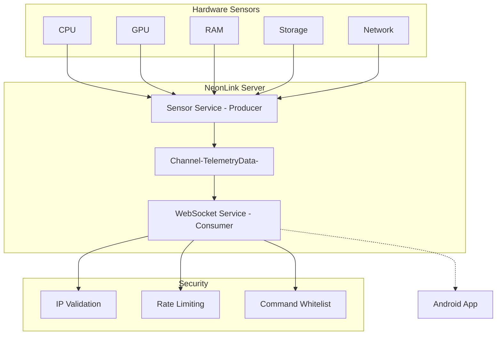

# NeonLink - Текущее Состояние и План Работ

## Текущее Состояние Проекта

### ✅ NeonLink Server (ASP.NET Core WebSocket Server) - ГОТОВ

**Реализовано:**
- [`SensorService.cs`](src/NeonLink.Server/Services/SensorService.cs) - мониторинг CPU/GPU/RAM/Storage/Network
- [`WebSocketService.cs`](src/NeonLink.Server/Services/WebSocketService.cs) - WebSocket сервер с broadcasting
- [`SecurityService.cs`](src/NeonLink.Server/Services/SecurityService.cs) - IP validation, rate limiting
- [`CommandService.cs`](src/NeonLink.Server/Services/CommandService.cs) - обработка команд
- [`CacheService.cs`](src/NeonLink.Server/Services/CacheService.cs) - thread-safe кеширование
- [`TelemetryChannelService.cs`](src/NeonLink.Server/Services/TelemetryChannelService.cs) - Producer-Consumer канал
- [`NetworkService.cs`](src/NeonLink.Server/Services/NetworkService.cs) - mDNS, ping
- [`Program.cs`](src/NeonLink.Server/Program.cs) - точка входа
- [`Configuration/Settings.cs`](src/NeonLink.Server/Configuration/Settings.cs) - конфигурация
- [`Models/TelemetryData.cs`](src/NeonLink.Server/Models/TelemetryData.cs) - модели данных
- [`Utilities/ThreadSafeHelper.cs`](src/NeonLink.Server/Utilities/ThreadSafeHelper.cs) - утилиты

**Примечание:** Сервер работает как **headless service** (без UI), WPF UI удален из проекта.

### ✅ Unit Tests - ЧАСТИЧНО ГОТОВЫ

- [`SensorServiceTests.cs`](tests/NeonLink.Tests/SensorServiceTests.cs) - 50+ тестов ✅
- [`SecurityServiceTests.cs`](tests/NeonLink.Tests/SecurityServiceTests.cs) - 50+ тестов ✅
- [`TelemetryChannelServiceTests.cs`](tests/NeonLink.Tests/TelemetryChannelServiceTests.cs) - ✅

### ❌ Android App - НЕ СОЗДАН

Согласно [`neonlink-android-plan.md`](plans/neonlink-android-plan.md) - Flutter приложение не создано.

---

## Архитектура Системы

---

## Оценка Готовности

| Компонент | Готовность | Статус |
|-----------|------------|--------|
| Server Core | 100% | ✅ Готов |
| Server Tests | 75% | ⚠️ Частично |
| Android App | 0% | ❌ Не начат |

---

## Следующие Шаги

### Фаза 1: Завершение Тестирования Сервера

1. Запустить тесты: `dotnet test`
2. Добавить недостающие тесты для CommandService, CacheService, NetworkService
3. Собрать и протестировать сервер локально

### Фаза 2: Android App (Согласно Плану)

**Этап 1: Foundation**
- Создать Flutter проект
- Настроить pubspec.yaml с зависимостями
- Создать JSON модели

**Этап 2: Services**
- WebSocketService с exponential backoff
- DiscoveryService для UDP broadcast

**Этап 3: UI**
- Connection Screen
- Dashboard (Circular Gauges, Compact, Graph, Gaming)
- Control Panel

---

## Рекомендуемый Порядок Работы

1. **Сейчас:** Запустить тесты и убедиться что сервер работает
2. **После:** Создать Android приложение согласно плану
