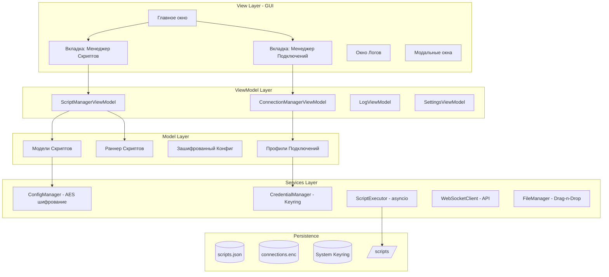
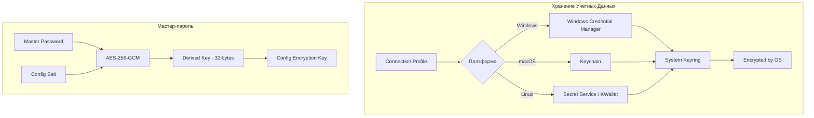

# NeonLink Control Center - Техническое Задание

## 1. Архитектура Системы

### 1.1 Общая Структура (MVVM)



### 1.2 Паттерны Проектирования

| Паттерн | Применение | Описание |
|---------|------------|-----------|
| **MVVM** | GUI + бизнес-логика | Разделение View, ViewModel, Model для тестируемости |
| **Repository** | Доступ к данным | Абстракция над storage (файлы, keyring) |
| **Service Locator** | DI без контейнера | Локатор сервисов для ViewModels |
| **Observer** | Real-time логи | Наблюдатели для stdout/stderr |
| **Strategy** | Скрипты | Разные стратегии для Python/Bash/PowerShell |
| **Command** | Undo/Redo | Инкапсуляция операций для истории |

### 1.3 Структура Проекта

```
NeonLink.Desktop/
├── src/
│   ├── neonlink_desktop/
│   │   ├── __main__.py                    # Entry point
│   │   ├── app.py                          # Application class
│   │   ├── config.py                       # Константы, версии
│   │   │
│   │   ├── models/                         # Data Models
│   │   │   ├── __init__.py
│   │   │   ├── script_model.py             # ScriptItem, ScriptStatus
│   │   │   ├── connection_model.py        # ConnectionProfile
│   │   │   ├── log_entry.py               # LogEntry
│   │   │   └── config_model.py            # AppConfig
│   │   │
│   │   ├── viewmodels/                     # ViewModels (MVVM)
│   │   │   ├── __init__.py
│   │   │   ├── base_viewmodel.py          # Abstract base class
│   │   │   ├── script_manager_vm.py       # Script management logic
│   │   │   ├── connection_manager_vm.py   # Connection CRUD logic
│   │   │   ├── log_viewmodel.py           # Log streaming logic
│   │   │   └── settings_viewmodel.py      # Settings logic
│   │   │
│   │   ├── views/                          # GUI Components
│   │   │   ├── __init__.py
│   │   │   ├── main_window.py             # QMainWindow
│   │   │   ├── script_manager_view.py     # Script list, drag-drop
│   │   │   ├── connection_manager_view.py # Connection forms
│   │   │   ├── log_view.py                # Real-time logs
│   │   │   ├── settings_view.py           # Settings dialog
│   │   │   └── components/                # Reusable UI components
│   │   │       ├── script_card.py         # Script item widget
│   │   │       ├── connection_card.py     # Connection item widget
│   │   │       ├── log_widget.py          # Log display widget
│   │   │       └── themed_widgets.py      # Styled components
│   │   │
│   │   ├── services/                       # Business Logic Services
│   │   │   ├── __init__.py
│   │   │   ├── config_manager.py          # AES encryption config
│   │   │   ├── credential_manager.py      # System keyring wrapper
│   │   │   ├── script_runner.py           # Async script execution
│   │   │   ├── script_installer.py        # Install methods
│   │   │   ├── websocket_client.py        # API client
│   │   │   ├── file_watcher.py            # Drag-drop handler
│   │   │   ├── theme_service.py           # Dark/Light themes
│   │   │   └── validation_service.py      # IP, port validation
│   │   │
│   │   ├── utils/                          # Utilities
│   │   │   ├── __init__.py
│   │   │   ├── decorators.py              # Thread-safe decorators
│   │   │   ├── asyncio_utils.py           # Async helpers
│   │   │   ├── cryptography.py            # AES helpers
│   │   │   └── json_helpers.py            # Typed JSON serialization
│   │   │
│   │   └── resources/                      # Resources
│   │       ├── icons/
│   │       ├── styles/
│   │       │   ├── dark_theme.qss        # Dark theme stylesheet
│   │       │   └── light_theme.qss       # Light theme stylesheet
│   │       └── translations/             # i18n files
│   │
│   ├── tests/
│   │   ├── __init__.py
│   │   ├── conftest.py
│   │   ├── unit/
│   │   │   ├── test_models.py
│   │   │   ├── test_services.py
│   │   │   └── test_viewmodels.py
│   │   └── integration/
│   │       ├── test_script_flow.py
│   │       └── test_connection_flow.py
│   │
│   ├── scripts/
│   │   ├── build.py                       # PyInstaller/Nuitka build
│   │   └── install_dependencies.py        # Dependency installer
│   │
│   ├── pyproject.toml
│   ├── requirements.txt
│   └── README.md
```

---

## 2. Технологический Стек

### 2.1 Обоснование Выбора GUI Фреймворка

| Критерий | PyQt6/PySide6 | Flet | Electron |
|----------|---------------|------|----------|
| **Нативность UI** | ✅ Qt native | ⚠️ Flutter render | ❌ WebView |
| **Flat Design** | ✅ QML/Stylesheets | ✅ Material | ✅ CSS |
| **Dark Theme** | ✅ Полная поддержка | ✅ Встроена | ✅ CSS |
| **Windows/macOS/Linux** | ✅ Нативный | ✅ Кроссплатформа | ✅ Кроссплатформа |
| **Python интеграция** | ✅ Прямая | ✅ Требует wrapper | ❌ Node.js only |
| **Размер бинарника** | ~40-60 MB | ~80-100 MB | ~150-200 MB |
| **Drag-and-Drop** | ✅ Нативный | ✅ | ✅ |
| **Performance** | ✅ Высокий | ✅ Высокий | ⚠️ Средний |
| **Упаковка** | PyInstaller/Nuitka | PyInstaller | electron-builder |

**ВЫБОР: PyQt6/PySide6**

**Обоснование:**
1. **Нативный look-and-feel** - Qt использует нативные контролы на каждой ОС
2. **Полный контроль над UI** - QSS (Qt Style Sheets) для современного flat design
3. **Pythonic** - Прямая интеграция без wrapper-ов (в отличие от Flet)
4. **Зрелость** - Qt существует 25+ лет, стабильный API
5. **Размер** - Меньший размер бинарника чем Electron/Flet
6. ** asyncio поддержка** - PyQt6 6.5+ нативно поддерживает asyncio

### 2.2 Полный Стек Технологий

```python
# pyproject.toml - Основные зависимости

[project]
name = "neonlink-desktop"
version = "1.0.0"
requires-python = ">=3.10"

dependencies = [
    # GUI Framework
    "PyQt6>=6.6.0",
    
    # Async
    "anyio>=4.0",
    "aiofiles>=23.0",
    
    # Security
    "cryptography>=41.0",
    "keyring>=24.0",
    "keyrings.cryptfile>=1.7.0",  # Linux keyring backend
    
    # WebSocket/API
    "websockets>=12.0",
    "aiohttp>=3.9",
    
    # Configuration
    "pydantic>=2.5",
    "python-dotenv>=1.0",
    
    # Drag-and-Drop & Files
    "watchdog>=4.0",
    
    # Logging
    "structlog>=23.2",
    "colorlog>=6.8",
    
    # Utilities
    "tenacity>=8.2",  # Retry logic
    "marshmallow>=3.20",  # Validation
]
```

### 2.3 Сравнение Упаковки

| Инструмент | Плюсы | Минусы |
|------------|-------|--------|
| **PyInstaller** | ✅ Прост в использовании | ❌ Большой размер |
| | ✅ Хорошо документирован | ❌ Медленная сборка |
| | ✅ Много hook-ов | ❌ Не полностью one-file |
| **Nuitka** | ✅ Оптимизация | ❌ Требует C++ компилятор |
| | ✅ Меньший размер | ❌ Сложнее настройка |
| | ✅ Cython-like performance | ❌ Дольше компиляция |

**ВЫБОР: PyInstaller** - для simplicity и совместимости

---

## 3. Безопасность

### 3.1 Механизм Хранения Паролей



### 3.2 ConfigManager - Шифрование Конфигурации

```python
# src/neonlink_desktop/services/config_manager.py

import os
import json
import base64
import hashlib
from cryptography.hazmat.primitives.ciphers.aead import AESGCM
from cryptography.hazmat.primitives.kdf.pbkdf2 import PBKDF2HMAC
from cryptography.hazmat.primitives import hashes
from cryptography.hazmat.backends import default_backend
from pathlib import Path
from typing import TypeVar, Generic, Type, Any
from pydantic import BaseModel

T = TypeVar('T', bound=BaseModel)


class EncryptionError(Exception):
    """Ошибка шифрования/дешифрования"""
    pass


class ConfigManager(Generic[T]):
    """
    Менеджер конфигураций с AES-256-GCM шифрованием.
    
    Использует:
    - AES-256-GCM для симметричного шифрования
    - PBKDF2HMAC для деривации ключа из мастер-пароля
    - 16-байтовый nonce для каждого шифрования
    """
    
    CONFIG_DIR = Path.home() / '.config' / 'neonlink'
    CONFIG_FILE = CONFIG_DIR / 'config.enc'
    MASTER_KEY_FILE = CONFIG_DIR / '.master_key'
    
    # Параметры PBKDF2
    SALT_SIZE = 32
    ITERATIONS = 600_000  # OWASP рекомендация
    KEY_LENGTH = 32  # 256 бит для AES-256
    
    def __init__(
        self,
        config_model: Type[T],
        master_password: str | None = None
    ):
        self.config_model = config_model
        self._ensure_config_dir()
        
        if master_password:
            self._master_password = master_password
            self._master_key = self._derive_key(master_password)
        else:
            self._master_password = None
            self._master_key = self._load_or_create_master_key()
    
    def _ensure_config_dir(self) -> None:
        """Создать директорию конфига с правильными правами"""
        self.CONFIG_DIR.mkdir(parents=True, exist_ok=True)
        # Unix: rwx------ (700)
        os.chmod(self.CONFIG_DIR, 0o700)
    
    def _derive_key(self, password: str, salt: bytes | None = None) -> tuple[bytes, bytes]:
        """
        Деривация ключа из мастер-пароля.
        
        Returns: (key, salt) - ключ и соль для сохранения
        """
        salt = salt or os.urandom(self.SALT_SIZE)
        
        kdf = PBKDF2HMAC(
            algorithm=hashes.SHA256(),
            length=self.KEY_LENGTH,
            salt=salt,
            iterations=self.ITERATIONS,
            backend=default_backend()
        )
        
        key = kdf.derive(password.encode('utf-8'))
        return key, salt
    
    def _load_or_create_master_key(self) -> bytes:
        """
        Загрузить существующий мастер-ключ или создать новый.
        Ключ хранится в зашифрованном виде с помощью OS keyring.
        """
        if self.MASTER_KEY_FILE.exists():
            try:
                from keyring import get_password
                # Получаем зашифрованный ключ из keyring
                encrypted_key_b64 = get_password('neonlink', 'master_key')
                if encrypted_key_b64:
                    encrypted_key = base64.b64decode(encrypted_key_b64)
                    # Расшифровываем (в реальном сценарии - через OS API)
                    return encrypted_key
        
        # Создаем новый мастер-ключ
        new_key = os.urandom(self.KEY_LENGTH)
        
        # Сохраняем в OS keyring
        from keyring import set_password
        encrypted_key_b64 = base64.b64encode(new_key).decode('utf-8')
        set_password('neonlink', 'master_key', encrypted_key_b64)
        
        # Создаем пустой конфиг с дефолтными значениями
        self.save(config_model := self.config_model())
        return new_key
    
    def encrypt(self, data: bytes) -> bytes:
        """
        Зашифровать данные с помощью AES-256-GCM.
        
        Format: nonce (12) + ciphertext + auth_tag (16)
        """
        nonce = os.urandom(12)  # GCM recommended nonce size
        aesgcm = AESGCM(self._master_key)
        
        ciphertext = aesgcm.encrypt(nonce, data, None)
        
        # Объединяем nonce + ciphertext (который уже содержит tag)
        return nonce + ciphertext
    
    def decrypt(self, encrypted_data: bytes) -> bytes:
        """
        Расшифровать данные.
        """
        if len(encrypted_data) < 28:  # 12 (nonce) + 16 (tag) + min data
            raise EncryptionError("Invalid encrypted data format")
        
        nonce = encrypted_data[:12]
        ciphertext = encrypted_data[12:]
        
        aesgcm = AESGCM(self._master_key)
        return aesgcm.decrypt(nonce, ciphertext, None)
    
    def save(self, config: T) -> None:
        """Сохранить конфигурацию в зашифрованный файл"""
        json_data = config.model_dump_json()
        data_bytes = json_data.encode('utf-8')
        
        encrypted = self.encrypt(data_bytes)
        
        self.CONFIG_FILE.write_bytes(encrypted)
        # Unix: rw------- (600)
        os.chmod(self.CONFIG_FILE, 0o600)
    
    def load(self) -> T:
        """Загрузить конфигурацию из файла"""
        if not self.CONFIG_FILE.exists():
            return self.config_model()
        
        encrypted = self.CONFIG_FILE.read_bytes()
        data_bytes = self.decrypt(encrypted)
        
        json_data = data_bytes.decode('utf-8')
        return self.config_model.model_validate_json(json_data)
    
    def verify_password(self, password: str) -> bool:
        """Проверить мастер-пароль"""
        try:
            _, salt = self._derive_key(password, self._salt)
            test_key, _ = self._derive_key(password, salt)
            return test_key == self._master_key
        except Exception:
            return False
```

### 3.3 CredentialManager - Системный Keyring

```python
# src/neonlink_desktop/services/credential_manager.py

from abc import ABC, abstractmethod
from typing import Optional
from contextlib import contextmanager
import keyring
from keyring.backends.fail import Keyring as FailKeyring

# Установить предпочтительный backend
try:
    import keyring.backends.Windows
    keyring.set_keyring(keyring.backends.Windows.Win32Keyring())
except ImportError:
    pass

try:
    import keyring.backends.macOS
    keyring.set_keyring(keyring.backends.macOS.Keyring())
except ImportError:
    pass

try:
    import keyring.backends.SecretService
    keyring.set_keyring(keyring.backends.SecretService.Keyring())
except ImportError:
    pass


class CredentialStorageError(Exception):
    """Ошибка работы с хранилищем учетных данных"""
    pass


class CredentialManager:
    """
    Менеджер для безопасного хранения учетных данных в системном keyring.
    
    Поддерживаемые бэкенды:
    - Windows: Win32 Credential Manager
    - macOS: Keychain
    - Linux: SecretService (GNOME) или KWallet
    """
    
    SERVICE_NAME = 'neonlink_desktop'
    
    def __init__(self):
        self._backend = keyring.get_keyring()
        
        if isinstance(self._backend, FailKeyring):
            raise CredentialStorageError(
                "No suitable keyring backend available. "
                "Please install keyring[windows] or keyring[macOS] or libsecret on Linux."
            )
    
    def save_credential(
        self,
        profile_id: str,
        username: str,
        password: str,
        extra_params: Optional[dict] = None
    ) -> None:
        """
        Сохранить учетные данные для профиля подключения.
        
        Хранится:
        - username:plaintext
        - password:{profile_id}
        - extra_params:{profile_id} - опционально
        """
        try:
            # Сохраняем пароль
            keyring.set_password(
                self.SERVICE_NAME,
                f"password:{profile_id}",
                password
            )
            
            # Сохраняем extra_params если есть
            if extra_params:
                import json
                extra_json = json.dumps(extra_params)
                keyring.set_password(
                    self.SERVICE_NAME,
                    f"extra_params:{profile_id}",
                    extra_json
                )
        except Exception as e:
            raise CredentialStorageError(f"Failed to save credential: {e}")
    
    def get_credential(self, profile_id: str) -> tuple[str, str, dict]:
        """
        Получить учетные данные для профиля.
        
        Returns: (username, password, extra_params)
        """
        try:
            username = keyring.get_password(
                self.SERVICE_NAME,
                f"username:{profile_id}"
            )
            
            password = keyring.get_password(
                self.SERVICE_NAME,
                f"password:{profile_id}"
            )
            
            extra_json = keyring.get_password(
                self.SERVICE_NAME,
                f"extra_params:{profile_id}"
            )
            extra_params = json.loads(extra_json) if extra_json else {}
            
            return username, password, extra_params
            
        except Exception as e:
            raise CredentialStorageError(f"Failed to get credential: {e}")
    
    def delete_credential(self, profile_id: str) -> None:
        """Удалить учетные данные для профиля"""
        try:
            keyring.delete_password(self.SERVICE_NAME, f"password:{profile_id}")
            keyring.delete_password(self.SERVICE_NAME, f"username:{profile_id}")
            
            try:
                keyring.delete_password(self.SERVICE_NAME, f"extra_params:{profile_id}")
            except keyring.errors.KeyringError:
                pass  # Extra params могли не существовать
                
        except Exception as e:
            raise CredentialStorageError(f"Failed to delete credential: {e}")
    
    def test_connection(self, host: str, port: int, timeout: float = 5.0) -> bool:
        """
        Проверить доступность хоста (ping или socket connection).
        """
        import socket
        
        sock = socket.socket(socket.AF_INET, socket.SOCK_STREAM)
        sock.settimeout(timeout)
        
        try:
            result = sock.connect_ex((host, port))
            return result == 0
        except socket.error:
            return False
        finally:
            sock.close()
```

---

## 4. UI/UX Wireframes

### 4.1 Главное Окно (Main Window)

```
┌─────────────────────────────────────────────────────────────────────────┐
│  🟣 NeonLink Control Center                                    ─ □ × │
├─────────────────────────────────────────────────────────────────────────┤
│  ┌──────┬──────┬──────┐                                                    │
│  │ 📜   │ 🔌   │ ⚙️   │  [Script Manager] [Connections] [Settings]         │
│  │ Скрипт│ Подкл│Настр │                                                    │
│  └──────┴──────┴──────┘                                                    │
├─────────────────────────────────────────────────────────────────────────┤
│  ┌──────────────────────────┐  ┌────────────────────────────────────────┐ │
│  │ 📁 Drop scripts here     │  │ 🔌 Подключения                          │ │
│  │                          │  │ ┌────────────────────────────────────┐ │ │
│  │  📄 install.py           │  │ │ 🔴 Server 1 (192.168.1.100)        │ │ │
│  │     [Python] [32KB]      │  │ │ Status: Disconnected    [Connect]  │ │ │
│  │                          │  │ └────────────────────────────────────┘ │ │
│  │  📄 backup.sh             │  │ ┌────────────────────────────────────┐ │ │
│  │     [Bash] [15KB]        │  │ │ 🟢 Laptop (10.0.0.50:9876)          │ │ │
│  │                          │  │ │ Status: Connected     [Disconnect] │ │ │
│  │  📄.ps1                   │  │ └────────────────────────────────────┘ │ │
│  │     [PowerShell] [8KB]   │  │ [+ Добавить] [✏️] [🗑️]                 │ │
│  │                          │  │                                        │ │
│  └──────────────────────────┘  └────────────────────────────────────────┘ │
│                                                                              │
│  ┌──────────────────────────┐  ┌────────────────────────────────────────┐ │
│  │ ▶️ Запущенные Скрипты     │  │ 📋 Логи (Real-time)                    │ │
│  │ ┌──────────────────────┐ │  │ ┌────────────────────────────────────┐ │ │
│  │ │ 🔄 install.py        │ │  │ [2024-01-15 10:23:45] INFO: ...    │ │ │
│  │ │ [■ Stop] [📊 Logs]   │ │  │ [2024-01-15 10:23:46] INFO: ...    │ │ │
│  │ └──────────────────────┘ │  │ [2024-01-15 10:23:47] DEBUG: ...    │ │ │
│  │ ┌──────────────────────┐ │  │ [2024-01-15 10:23:48] ERROR: ...    │ │ │
│  │ │ 🔄 monitor.sh        │ │  │ [2024-01-15 10:23:49] INFO: ...    │ │ │
│  │ │ [■ Stop] [📊 Logs]   │ │  │                                     │ │ │
│  │ └──────────────────────┘ │  │                                     │ │ │
│  │                          │  │                                     │ │ │
│  └──────────────────────────┘  └────────────────────────────────────┘ │ │
└─────────────────────────────────────────────────────────────────────────┘
```

### 4.2 Модальное Окно: Добавить/Редактировать Скрипт

```
┌─────────────────────────────────────────┐
│  ➕ Добавить Скрипт                 ─ □ × │
├─────────────────────────────────────────┤
│                                          │
│  📄 Файл: [install.py]      [📁 Обзор]  │
│                                          │
│  📝 Имя: [Install Dependencies]         │
│                                          │
│  🎯 Тип:  [Python ▼]                    │
│          • Python                        │
│          • Bash                          │
│          • PowerShell                    │
│                                          │
│  📂 Установка:                           │
│  ○ Копировать в scripts/                │
│  ○ Создать symlink                       │
│  ○ Добавить в PATH                       │
│                                          │
│  📂 Целевая директория:                  │
│     [/home/user/.local/bin] [📁 Обзор]   │
│                                          │
│  📄 Скрипт (preview):                    │
│  ┌─────────────────────────────────────┐│
│  │ #!/usr/bin/env python3              ││
│  │ import sys                          ││
│  │ ...                                 ││
│  └─────────────────────────────────────┘││
│                                          │
│                         [Отмена] [✓ Сохранить] │
└─────────────────────────────────────────┘
```

### 4.3 Модальное Окно: Добавить/Редактировать Подключение

```
┌─────────────────────────────────────────┐
│  ➕ Новое Подключение                ─ □ × │
├─────────────────────────────────────────┤
│                                          │
│  📝 Имя профиля: [My Server]            │
│                                          │
│  🌐 Хост: [192.168.1.100]                │
│                                          │
│  🔌 Порт: [9876]                         │
│         (Валидация: 1-65535)            │
│                                          │
│  👤 Логин: [admin]                       │
│                                          │
│  🔑 Пароль: [•••••••••••••••]           │
│         [👁️ Показать]                   │
│                                          │
│  ⚙️ Доп. параметры (JSON):               │
│  ┌─────────────────────────────────────┐│
│  │ {                                    ││
│  │   "timeout": 30,                     ││
│  │   "ssl": true,                       ││
│  │   "cert_path": "/path/to/cert.pem"   ││
│  │ }                                    ││
│  └─────────────────────────────────────┘│
│                                          │
│  [🔗 Test Connection]                    │
│                                          │
│                         [Отмена] [✓ Сохранить] │
└─────────────────────────────────────────┘
```

### 4.4 Окно Логов Скрипта

```
┌─────────────────────────────────────────┐
│  📊 Логи: install.py               ─ □ × │
├─────────────────────────────────────────┤
│  [📋 Копировать] [🗑️ Очистить] [⚡ Автоскролл] │
├─────────────────────────────────────────┤
│                                          │
│  [10:23:45.123] 🟢 STDOUT: Starting...  │
│  [10:23:45.124] 🟡 STDERR: Warning: ...  │
│  [10:23:45.456] 🟢 STDOUT: Processing... │
│  [10:23:45.789] 🟢 STDOUT: Done!         │
│  [10:23:45.790] 🔴 EXIT: Code 0          │
│                                          │
│  ██████████████████████████████████████ │
└─────────────────────────────────────────┘
```

---

## 5. Code Scaffolding

### 5.1 Модели Данных

```python
# src/neonlink_desktop/models/script_model.py

from enum import Enum
from pathlib import Path
from datetime import datetime
from pydantic import BaseModel, Field, field_validator
from typing import Optional


class ScriptType(str, Enum):
    """Типы поддерживаемых скриптов"""
    PYTHON = "python"
    BASH = "bash"
    POWERSHELL = "powershell"


class ScriptInstallMethod(str, Enum):
    """Метод установки скрипта"""
    COPY = "copy"
    SYMLINK = "symlink"
    PATH = "path"


class ScriptStatus(str, Enum):
    """Статус скрипта"""
    IDLE = "idle"
    RUNNING = "running"
    STOPPED = "stopped"
    ERROR = "error"


class ScriptModel(BaseModel):
    """
    Модель скрипта для хранения в конфигурации.
    
    Атрибуты:
        id: Уникальный идентификатор UUID
        name: Отображаемое имя скрипта
        source_path: Путь к исходному файлу
        install_method: Метод установки
        target_directory: Целевая директория для установки
        script_type: Тип скрипта
        arguments: Дополнительные аргументы командной строки
        environment: Переменные окружения (dict)
        auto_start: Автозапуск при старте приложения
        enabled: Включен ли скрипт в списке
        created_at: Дата создания записи
        updated_at: Дата последнего изменения
    """
    
    id: str = Field(default_factory=lambda: str(datetime.now().timestamp()))
    name: str = Field(..., min_length=1, max_length=100)
    source_path: Path
    install_method: ScriptInstallMethod = ScriptInstallMethod.COPY
    target_directory: Optional[Path] = None
    script_type: ScriptType
    arguments: str = ""
    environment: dict[str, str] = Field(default_factory=dict)
    auto_start: bool = False
    enabled: bool = True
    created_at: datetime = Field(default_factory=datetime.now)
    updated_at: datetime = Field(default_factory=datetime.now)
    
    @field_validator('source_path')
    @classmethod
    def validate_source_path(cls, v: Path) -> Path:
        if not v.exists():
            raise ValueError(f"Source path does not exist: {v}")
        if not v.is_file():
            raise ValueError(f"Source path is not a file: {v}")
        return v
    
    @property
    def file_size(self) -> int:
        """Размер файла в байтах"""
        return self.source_path.stat().st_size
    
    @property
    def extension(self) -> str:
        """Расширение файла"""
        return self.source_path.suffix.lower()
    
    @property
    def is_python(self) -> bool:
        """Является ли скрипт Python скриптом"""
        return self.extension == '.py' or self.script_type == ScriptType.PYTHON


class RunningScript(BaseModel):
    """
    Информация о запущенном скрипте.
    
    Атрибуты:
        script: Модель скрипта
        process: Ссылка на запущенный процесс (для управления)
        status: Текущий статус
        pid: Process ID
        start_time: Время запуска
        exit_code: Код завершения (если завершен)
        logs: Буфер логов
    """
    
    script: ScriptModel
    status: ScriptStatus = ScriptStatus.IDLE
    pid: Optional[int] = None
    start_time: Optional[datetime] = None
    exit_code: Optional[int] = None
    stdout_buffer: list[str] = Field(default_factory=list)
    stderr_buffer: list[str] = Field(default_factory=list)
```

```python
# src/neonlink_desktop/models/connection_model.py

from enum import Enum
from datetime import datetime
from pydantic import BaseModel, Field, field_validator, IPv4Address
from typing import Optional
import json


class ConnectionStatus(str, Enum):
    """Статус подключения"""
    UNKNOWN = "unknown"
    CONNECTING = "connecting"
    CONNECTED = "connected"
    DISCONNECTED = "disconnected"
    ERROR = "error"


class ExtraParams(BaseModel):
    """
    Дополнительные параметры подключения.
    
    Примеры:
        timeout: Таймаут соединения в секундах
        ssl: Использовать SSL/TLS
        ssl_verify: Проверять сертификат
        cert_path: Путь к клиентскому сертификату
        proxy: Прокси сервер
        keep_alive: Интервал keep-alive пакетов
    """
    
    timeout: int = Field(default=30, ge=1, le=300)
    ssl: bool = False
    ssl_verify: bool = True
    cert_path: Optional[str] = None
    proxy: Optional[str] = None
    keep_alive: int = Field(default=60, ge=10, le=3600)
    
    def to_json(self) -> str:
        return self.model_dump_json()
    
    @classmethod
    def from_json(cls, json_str: str) -> 'ExtraParams':
        return cls.model_validate_json(json_str)


class ConnectionProfile(BaseModel):
    """
    Модель профиля подключения.
    
    Атрибуты:
        id: Уникальный идентификатор UUID
        name: Отображаемое имя профиля
        host: IP адрес или hostname
        port: Порт (1-65535)
        username: Имя пользователя
        password: Пароль (хранится в keyring, не здесь!)
        extra_params: Дополнительные параметры
        last_connected: Дата последнего успешного подключения
        favorite: Избранный профиль (в начале списка)
        color: Цвет для визуальной идентификации
    """
    
    id: str = Field(default_factory=lambda: str(datetime.now().timestamp()))
    name: str = Field(..., min_length=1, max_length=100)
    host: str = Field(..., min_length=1, max_length=255)
    port: int = Field(default=9876, ge=1, le=65535)
    username: str = Field(..., min_length=1, max_length=100)
    password_hash: Optional[str] = None  # Deprecated, use keyring
    extra_params: ExtraParams = Field(default_factory=ExtraParams)
    last_connected: Optional[datetime] = None
    favorite: bool = False
    color: str = "#6C5CE7"  # Neon purple default
    
    @field_validator('host')
    @classmethod
    def validate_host(cls, v: str) -> str:
        # Проверка на валидный IP или hostname
        import re
        # Простая проверка hostname
        if re.match(r'^[a-zA-Z0-9]([a-zA-Z0-9-]{0,61}[a-zA-Z0-9])?(\.[a-zA-Z0-9]([a-zA-Z0-9-]{0,61}[a-zA-Z0-9])?)*$', v):
            return v
        # Проверка на IPv4
        try:
            import ipaddress
            ipaddress.IPv4Address(v)
            return v
        except ipaddress.AddressValueError:
            pass
        raise ValueError(f"Invalid host format: {v}")
    
    @property
    def connection_string(self) -> str:
        """Строка подключения для отображения"""
        return f"{self.username}@{{host}}:{self.port}".format(
            host=self.host,
            port=self.port
        )
```

### 5.2 ScriptRunner - Асинхронное Выполнение Скриптов

```python
# src/neonlink_desktop/services/script_runner.py

import asyncio
import signal
import subprocess
import os
import sys
from pathlib import Path
from typing import AsyncGenerator, Optional
from datetime import datetime
from loguru import logger

from ..models.script_model import ScriptModel, ScriptStatus, RunningScript


class ScriptExecutionError(Exception):
    """Ошибка выполнения скрипта"""
    pass


class ScriptRunner:
    """
    Асинхронный раннер скриптов с поддержкой:
    - Python, Bash, PowerShell
    - Real-time stdout/stderr streaming
    - Process lifecycle management (start/stop)
    - Thread-safe операции
    """
    
    def __init__(self):
        self._running_scripts: dict[str, RunningScript] = {}
        self._process_locks: dict[str, asyncio.Lock] = {}
        self._shutdown_event = asyncio.Event()
    
    async def start_script(
        self,
        script: ScriptModel,
        arguments: str = "",
        working_dir: Optional[Path] = None
    ) -> RunningScript:
        """
        Запустить скрипт в отдельном процессе.
        
        Args:
            script: Модель скрипта
            arguments: Дополнительные аргументы
            working_dir: Рабочая директория (по умолчанию - директория скрипта)
        
        Returns:
            RunningScript: Информация о запущенном процессе
        
        Raises:
            ScriptExecutionError: Если скрипт уже запущен или ошибка запуска
        """
        script_id = script.id
        
        if script_id in self._running_scripts:
            raise ScriptExecutionError(f"Script '{script.name}' is already running")
        
        # Блокировка для thread-safety
        if script_id not in self._process_locks:
            self._process_locks[script_id] = asyncio.Lock()
        
        async with self._process_locks[script_id]:
            # Подготовка командной строки
            cmd = self._build_command(script, arguments)
            
            # Подготовка окружения
            env = os.environ.copy()
            env.update(script.environment)
            
            # Рабочая директория
            cwd = working_dir or script.source_path.parent
            
            try:
                # Запуск процесса
                process = await asyncio.create_subprocess_exec(
                    *cmd,
                    stdout=asyncio.subprocess.PIPE,
                    stderr=asyncio.subprocess.PIPE,
                    env=env,
                    cwd=str(cwd)
                )
                
                running_script = RunningScript(
                    script=script,
                    status=ScriptStatus.RUNNING,
                    pid=process.pid,
                    start_time=datetime.now()
                )
                
                self._running_scripts[script_id] = running_script
                
                # Запуск асинхронного чтения output
                asyncio.create_task(self._stream_output(script_id, process))
                
                logger.info(f"Started script: {script.name} (PID: {process.pid})")
                return running_script
                
            except OSError as e:
                raise ScriptExecutionError(f"Failed to start script: {e}")
    
    def _build_command(self, script: ScriptModel, arguments: str) -> list[str]:
        """Собрать команду для запуска скрипта"""
        cmd = []
        
        if script.script_type.value == "python":
            cmd.extend([sys.executable, str(script.source_path)])
        elif script.script_type.value == "bash":
            cmd.extend(["/bin/bash", str(script.source_path)])
        elif script.script_type.value == "powershell":
            cmd.extend(["pwsh", "-File", str(script.source_path)])
        else:
            cmd.append(str(script.source_path))
        
        # Добавляем аргументы
        if arguments:
            cmd.extend(arguments.split())
        
        # Добавляем аргументы из модели
        if script.arguments:
            cmd.extend(script.arguments.split())
        
        return cmd
    
    async def _stream_output(
        self,
        script_id: str,
        process: asyncio.subprocess.Process
    ) -> None:
        """
        Асинхронный streaming stdout/stderr.
        
        Читает output построчно и логирует в реальном времени.
        """
        running_script = self._running_scripts.get(script_id)
        if not running_script:
            return
        
        stdout_lines = []
        stderr_lines = []
        
        try:
            while True:
                # Читаем stdout
                stdout_line = await process.stdout.readline()
                if stdout_line:
                    decoded = stdout_line.decode('utf-8', errors='replace').rstrip()
                    stdout_lines.append(decoded)
                    logger.info(f"[{running_script.script.name}] STDOUT: {decoded}")
                
                # Читаем stderr
                stderr_line = await process.stderr.readline()
                if stderr_line:
                    decoded = stderr_line.decode('utf-8', errors='replace').rstrip()
                    stderr_lines.append(decoded)
                    logger.warning(f"[{running_script.script.name}] STDERR: {decoded}")
                
                # Проверяем завершение процесса
                if process.returncode is not None:
                    break
                
                await asyncio.sleep(0.01)  # Не busy-wait
        
        except Exception as e:
            logger.error(f"Error streaming output for {script_id}: {e}")
        
        finally:
            # Обновляем статус
            await self._finalize_script(script_id, process.returncode)
    
    async def stop_script(self, script_id: str, timeout: float = 5.0) -> bool:
        """
        Остановить запущенный скрипт.
        
        Args:
            script_id: ID скрипта
            timeout: Время ожидания завершения (секунды)
        
        Returns:
            bool: True если процесс был успешно остановлен
        """
        running_script = self._running_scripts.get(script_id)
        if not running_script:
            return False
        
        pid = running_script.pid
        if not pid:
            return False
        
        async with self._process_locks.get(script_id, asyncio.Lock()):
            try:
                # Unix: SIGTERM, затем SIGKILL
                if sys.platform != 'win32':
                    try:
                        os.kill(pid, signal.SIGTERM)
                        await asyncio.sleep(timeout)
                        
                        # Проверяем, завершился ли процесс
                        try:
                            os.kill(pid, 0)  # Проверка существования
                            # Процесс still alive - посылаем SIGKILL
                            os.kill(pid, signal.SIGKILL)
                        except ProcessLookupError:
                            pass  # Процесс already завершен
                    
                    except ProcessLookupError:
                        pass  # Процесс already завершен
                else:
                    # Windows: os.terminate
                    import psutil
                    try:
                        proc = psutil.Process(pid)
                        proc.terminate()
                        proc.wait(timeout=timeout)
                    except (psutil.NoSuchProcess, psutil.AccessDenied):
                        pass
            
            except Exception as e:
                logger.error(f"Error stopping script {script_id}: {e}")
                return False
            
            return True
    
    async def _finalize_script(
        self,
        script_id: str,
        return_code: Optional[int]
    ) -> None:
        """Финализировать статус скрипта после завершения"""
        running_script = self._running_scripts.get(script_id)
        if not running_script:
            return
        
        async with self._process_locks.get(script_id, asyncio.Lock()):
            running_script.status = ScriptStatus.STOPPED if return_code == 0 else ScriptStatus.ERROR
            running_script.exit_code = return_code
            running_script.stdout_buffer = running_script.stdout_buffer[-1000:]  # Keep last 1000 lines
            running_script.stderr_buffer = running_script.stderr_buffer[-1000:]
            
            logger.info(
                f"Script '{running_script.script.name}' finished "
                f"with code {return_code}"
            )
    
    def get_running_script(self, script_id: str) -> Optional[RunningScript]:
        """Получить информацию о запущенном скрипте"""
        return self._running_scripts.get(script_id)
    
    def get_all_running(self) -> list[RunningScript]:
        """Получить список всех запущенных скриптов"""
        return list(self._running_scripts.values())
    
    async def shutdown(self) -> None:
        """Остановить все запущенные скрипты при выходе"""
        self._shutdown_event.set()
        
        for script_id in list(self._running_scripts.keys()):
            await self.stop_script(script_id, timeout=2.0)
        
        self._running_scripts.clear()
```

### 5.3 Пример Верстки Основного Окна (PyQt6)

```python
# src/neonlink_desktop/views/main_window.py

from PyQt6.QtWidgets import (
    QMainWindow, QWidget, QVBoxLayout, QHBoxLayout,
    QTabWidget, QToolBar, QStatusBar, QMenuBar, QMenu,
    QMessageBox, QFileDialog, QListWidget, QListWidgetItem,
    QPushButton, QLabel, QLineEdit, QFrame, QSplitter,
    QTextEdit, QProgressBar, QSystemTrayIcon
)
from PyQt6.QtCore import Qt, QSize, pyqtSignal, QThread, pyqtSlot
from PyQt6.QtGui import QAction, QIcon, QDragEnterEvent, QDropEvent

import sys
from pathlib import Path
from loguru import logger

from ..models.script_model import ScriptModel, ScriptType
from ..models.connection_model import ConnectionProfile
from ..viewmodels.script_manager_vm import ScriptManagerViewModel
from ..viewmodels.connection_manager_vm import ConnectionManagerViewModel
from ..viewmodels.log_viewmodel import LogViewModel


class DroppableListWidget(QListWidget):
    """
    ListWidget с поддержкой Drag-and-Drop для загрузки скриптов.
    
    Сигналы:
        files_dropped: Список загруженных файлов
    """
    
    files_dropped = pyqtSignal(list)
    
    def __init__(self, parent=None):
        super().__init__(parent)
        self.setAcceptDrops(True)
        self.setDragDropMode(QListWidget.DragDropMode.DropOnly)
        self.setSelectionMode(QListWidget.SelectionMode.ExtendedSelection)
    
    def dragEnterEvent(self, event: QDragEnterEvent):
        if event.mimeData().hasUrls():
            event.acceptProposedAction()
        else:
            event.ignore()
    
    def dragMoveEvent(self, event: QDragMoveEvent):
        if event.mimeData().hasUrls():
            event.acceptProposedAction()
        else:
            event.ignore()
    
    def dropEvent(self, event: QDropEvent):
        if event.mimeData().hasUrls():
            files = []
            for url in event.mimeData().urls():
                if url.isLocalFile():
                    path = Path(url.toLocalFile())
                    if path.is_file() and self._is_script_file(path):
                        files.append(path)
            
            if files:
                self.files_dropped.emit(files)
                event.acceptProposedAction()
                return
        
        event.ignore()
    
    def _is_script_file(self, path: Path) -> bool:
        """Проверка на поддерживаемые типы файлов"""
        suffixes = {'.py', '.sh', '.ps1', '.psm1'}
        return path.suffix.lower() in suffixes


class MainWindow(QMainWindow):
    """
    Главное окно приложения NeonLink Control Center.
    
    Структура:
    - МенюBar: File, Edit, View, Tools, Help
    - ToolBar: Быстрые действия
    - Central Widget: TabWidget с Script Manager и Connections
    - StatusBar: Статус приложения
    - System Tray: Иконка в трее
    """
    
    def __init__(
        self,
        script_vm: ScriptManagerViewModel,
        connection_vm: ConnectionManagerViewModel,
        log_vm: LogViewModel
    ):
        super().__init__()
        
        self.script_vm = script_vm
        self.connection_vm = connection_vm
        self.log_vm = log_vm
        
        self._setup_ui()
        self._setup_menus()
        self._setup_toolbar()
        self._setup_tray_icon()
        self._connect_signals()
        
        logger.info("MainWindow initialized")
    
    def _setup_ui(self):
        """Настройка UI компонентов"""
        self.setWindowTitle("NeonLink Control Center")
        self.setMinimumSize(1200, 800)
        self.resize(1400, 900)
        
        # Central widget with tabs
        central_widget = QWidget()
        self.setCentralWidget(central_widget)
        
        main_layout = QVBoxLayout(central_widget)
        main_layout.setContentsMargins(0, 0, 0, 0)
        
        # Tab widget
        self.tab_widget = QTabWidget()
        self.tab_widget.setDocumentMode(True)
        self.tab_widget.setTabsClosable(False)
        
        # Tab 1: Script Manager
        self.script_manager_view = self._create_script_manager_view()
        self.tab_widget.addTab(self.script_manager_view, "📜 Скрипты")
        
        # Tab 2: Connections
        self.connection_manager_view = self._create_connection_manager_view()
        self.tab_widget.addTab(self.connection_manager_view, "🔌 Подключения")
        
        main_layout.addWidget(self.tab_widget)
        
        # Status bar
        self.status_bar = QStatusBar()
        self.setStatusBar(self.status_bar)
        self.status_bar.showMessage("Готов")
    
    def _create_script_manager_view(self) -> QWidget:
        """Создание View для управления скриптами"""
        widget = QWidget()
        layout = QHBoxLayout(widget)
        
        # Splitter for resizable panels
        splitter = QSplitter(Qt.Orientation.Horizontal)
        
        # Left: Script list with drag-drop
        left_panel = QFrame()
        left_layout = QVBoxLayout(left_panel)
        left_layout.setContentsMargins(10, 10, 10, 10)
        
        # Drop zone label
        drop_label = QLabel("📁 Перетащите скрипты сюда\n(.py, .sh, .ps1)")
        drop_label.setAlignment(Qt.AlignmentFlag.AlignCenter)
        drop_label.setStyleSheet("""
            QLabel {
                border: 2px dashed #6C5CE7;
                border-radius: 8px;
                background-color: #2D2D3A;
                color: #A0A0B0;
                padding: 20px;
                font-size: 14px;
            }
        """)
        left_layout.addWidget(drop_label)
        
        # Script list
        self.script_list = DroppableListWidget()
        self.script_list.setStyleSheet("""
            QListWidget {
                background-color: #1E1E2E;
                border: 1px solid #3D3D4D;
                border-radius: 4px;
            }
            QListWidget::item {
                padding: 8px;
                border-bottom: 1px solid #3D3D4D;
            }
            QListWidget::item:selected {
                background-color: #6C5CE7;
            }
        """)
        left_layout.addWidget(self.script_list)
        
        # Script actions
        script_actions_layout = QHBoxLayout()
        
        self.btn_add_script = QPushButton("➕ Добавить")
        self.btn_remove_script = QPushButton("🗑️ Удалить")
        self.btn_refresh_scripts = QPushButton("🔄 Обновить")
        
        script_actions_layout.addWidget(self.btn_add_script)
        script_actions_layout.addWidget(self.btn_remove_script)
        script_actions_layout.addWidget(self.btn_refresh_scripts)
        script_actions_layout.addStretch()
        
        left_layout.addLayout(script_actions_layout)
        
        # Right: Running scripts and logs
        right_panel = QWidget()
        right_layout = QVBoxLayout(right_panel)
        right_layout.setContentsMargins(10, 10, 10, 10)
        
        # Running scripts section
        running_label = QLabel("▶️ Запущенные Скрипты")
        running_label.setStyleSheet("font-weight: bold; font-size: 14px;")
        right_layout.addWidget(running_label)
        
        self.running_scripts_list = QListWidget()
        self.running_scripts_list.setMaximumHeight(200)
        self.running_scripts_list.setStyleSheet("""
            QListWidget {
                background-color: #1E1E2E;
                border: 1px solid #3D3D4D;
                border-radius: 4px;
            }
        """)
        right_layout.addWidget(self.running_scripts_list)
        
        # Running script actions
        running_actions_layout = QHBoxLayout()
        self.btn_stop_script = QPushButton("⏹️ Остановить")
        self.btn_view_logs = QPushButton("📋 Логи")
        running_actions_layout.addWidget(self.btn_stop_script)
        running_actions_layout.addWidget(self.btn_view_logs)
        right_layout.addLayout(running_actions_layout)
        
        # Logs section
        logs_label = QLabel("📋 Логи (Real-time)")
        logs_label.setStyleSheet("font-weight: bold; font-size: 14px;")
        right_layout.addWidget(logs_label)
        
        self.logs_text = QTextEdit()
        self.logs_text.setReadOnly(True)
        self.logs_text.setStyleSheet("""
            QTextEdit {
                background-color: #0D0D1A;
                border: 1px solid #3D3D4D;
                border-radius: 4px;
                font-family: Consolas, monospace;
                font-size: 11px;
                color: #E0E0E0;
            }
        """)
        right_layout.addWidget(self.logs_text)
        
        # Add panels to splitter
        splitter.addWidget(left_panel)
        splitter.addWidget(right_panel)
        splitter.setSizes([400, 600])
        
        layout.addWidget(splitter)
        
        return widget
    
    def _create_connection_manager_view(self) -> QWidget:
        """Создание View для управления подключениями"""
        widget = QWidget()
        layout = QVBoxLayout(widget)
        layout.setContentsMargins(10, 10, 10, 10)
        
        # Toolbar
        toolbar_layout = QHBoxLayout()
        
        self.btn_add_connection = QPushButton("➕ Добавить")
        self.btn_edit_connection = QPushButton("✏️ Редактировать")
        self.btn_delete_connection = QPushButton("🗑️ Удалить")
        self.btn_test_connection = QPushButton("🔗 Тест")
        
        toolbar_layout.addWidget(self.btn_add_connection)
        toolbar_layout.addWidget(self.btn_edit_connection)
        toolbar_layout.addWidget(self.btn_delete_connection)
        toolbar_layout.addWidget(self.btn_test_connection)
        toolbar_layout.addStretch()
        
        layout.addLayout(toolbar_layout)
        
        # Connections list
        self.connections_list = QListWidget()
        self.connections_list.setStyleSheet("""
            QListWidget {
                background-color: #1E1E2E;
                border: 1px solid #3D3D4D;
                border-radius: 4px;
            }
        """)
        layout.addWidget(self.connections_list)
        
        # Connection details panel
        details_label = QLabel("📋 Детали Подключения")
        details_label.setStyleSheet("font-weight: bold; font-size: 14px;")
        layout.addWidget(details_label)
        
        self.connection_details = QTextEdit()
        self.connection_details.setReadOnly(True)
        self.connection_details.setMaximumHeight(150)
        self.connection_details.setStyleSheet("""
            QTextEdit {
                background-color: #1E1E2E;
                border: 1px solid #3D3D4D;
                border-radius: 4px;
            }
        """)
        layout.addWidget(self.connection_details)
        
        return widget
    
    def _setup_menus(self):
        """Настройка меню"""
        menubar = self.menuBar()
        
        # File menu
        file_menu = menubar.addMenu("Файл")
        
        add_script_action = QAction("📜 Добавить скрипт...", self)
        add_script_action.setShortcut("Ctrl+N")
        file_menu.addAction(add_script_action)
        
        add_connection_action = QAction("🔌 Добавить подключение...", self)
        add_connection_action.setShortcut("Ctrl+Shift+N")
        file_menu.addAction(add_connection_action)
        
        file_menu.addSeparator()
        
        settings_action = QAction("⚙️ Настройки...", self)
        settings_action.setShortcut("Ctrl+,")
        file_menu.addAction(settings_action)
        
        file_menu.addSeparator()
        
        exit_action = QAction("🚪 Выход", self)
        exit_action.setShortcut("Ctrl+Q")
        file_menu.addAction(exit_action)
        
        # View menu
        view_menu = menubar.addMenu("Вид")
        
        dark_theme_action = QAction("🌙 Тёмная тема", self)
        view_menu.addAction(dark_theme_action)
        
        light_theme_action = QAction("☀️ Светлая тема", self)
        view_menu.addAction(light_theme_action)
        
        view_menu.addSeparator()
        
        scripts_tab_action = QAction("📜 Скрипты", self)
        view_menu.addAction(scripts_tab_action)
        
        connections_tab_action = QAction("🔌 Подключения", self)
        view_menu.addAction(connections_tab_action)
        
        # Help menu
        help_menu = menubar.addMenu("Помощь")
        
        about_action = QAction("ℹ️ О приложении", self)
        help_menu.addAction(about_action)
    
    def _setup_toolbar(self):
        """Настройка toolbar"""
        toolbar = QToolBar()
        toolbar.setMovable(False)
        toolbar.setIconSize(QSize(24, 24))
        self.addToolBar(toolbar)
        
        # Add toolbar actions
        add_script_tb = QAction("📜", self)
        add_script_tb.setToolTip("Добавить скрипт")
        toolbar.addAction(add_script_tb)
        
        add_connection_tb = QAction("🔌", self)
        add_connection_tb.setToolTip("Добавить подключение")
        toolbar.addAction(add_connection_tb)
        
        toolbar.addSeparator()
        
        settings_tb = QAction("⚙️", self)
        settings_tb.setToolTip("Настройки")
        toolbar.addAction(settings_tb)
    
    def _setup_tray_icon(self):
        """Настройка system tray иконки"""
        if QSystemTrayIcon.isSystemTrayAvailable():
            self.tray_icon = QSystemTrayIcon(self)
            self.tray_icon.setToolTip("NeonLink Control Center")
            # TODO: Установить иконку
            # self.tray_icon.setIcon(QIcon(":/icons/tray_icon.png"))
            
            # Context menu for tray
            tray_menu = QMenu()
            
            show_action = QAction("📖 Показать", self)
            tray_menu.addAction(show_action)
            
            tray_menu.addSeparator()
            
            quit_action = QAction("🚪 Выход", self)
            tray_menu.addAction(quit_action)
            
            self.tray_icon.setContextMenu(tray_menu)
            self.tray_icon.show()
    
    def _connect_signals(self):
        """Подключение сигналов"""
        # Script list drag-drop
        self.script_list.files_dropped.connect(self._on_scripts_dropped)
        
        # Script actions
        self.btn_add_script.clicked.connect(self._on_add_script)
        self.btn_remove_script.clicked.connect(self._on_remove_script)
        self.btn_refresh_scripts.clicked.connect(self._on_refresh_scripts)
        
        # Running script actions
        self.btn_stop_script.clicked.connect(self._on_stop_script)
        self.btn_view_logs.clicked.connect(self._on_view_logs)
        
        # Connection actions
        self.btn_add_connection.clicked.connect(self._on_add_connection)
        self.btn_edit_connection.clicked.connect(self._on_edit_connection)
        self.btn_delete_connection.clicked.connect(self._on_delete_connection)
        self.btn_test_connection.clicked.connect(self._on_test_connection)
        
        # Connection selection
        self.connections_list.itemSelectionChanged.connect(
            self._on_connection_selected
        )
    
    @pyqtSlot(list)
    def _on_scripts_dropped(self, files: list):
        """Обработка drop события для скриптов"""
        self.status_bar.showMessage(f"Загружено {len(files)} скриптов...")
        
        for file_path in files:
            try:
                script = self.script_vm.add_script_from_path(Path(file_path))
                self._add_script_to_list(script)
                logger.info(f"Added script: {script.name}")
            except Exception as e:
                QMessageBox.warning(
                    self,
                    "Ошибка",
                    f"Не удалось добавить скрипт {file_path}: {e}"
                )
        
        self.status_bar.showMessage("Готов")
    
    def _add_script_to_list(self, script: ScriptModel):
        """Добавить скрипт в список"""
        item = QListWidgetItem(f"📄 {script.name}")
        item.setData(Qt.ItemDataRole.UserRole, script.id)
        
        # Цветовая индикация по типу
        if script.script_type == ScriptType.PYTHON:
            item.setForeground(Qt.GlobalColor.darkCyan)
        elif script.script_type == ScriptType.BASH:
            item.setForeground(Qt.GlobalColor.darkGreen)
        elif script.script_type == ScriptType.POWERSHELL:
            item.setForeground(Qt.GlobalColor.blue)
        
        self.script_list.addItem(item)
    
    # TODO: Add remaining slot handlers...
    
    def closeEvent(self, event):
        """Обработка закрытия окна"""
        reply = QMessageBox.question(
            self,
            "Выход",
            "Вы уверены, что хотите выйти?",
            QMessageBox.StandardButton.Yes | QMessageBox.StandardButton.No
        )
        
        if reply == QMessageBox.StandardButton.Yes:
            # Останавливаем все скрипты
            self.script_vm.stop_all_scripts()
            event.accept()
        else:
            event.ignore()
    
    def showEvent(self, event):
        """Показать окно (из трея)"""
        super().showEvent(event)
        self.setWindowState(self.windowState() & ~Qt.WindowState.WindowMinimized)
```

---

## 6. План Реализации

### 6.1 Этап 1: Foundation

1. **Настройка проекта**
   - Создать `pyproject.toml` с зависимостями
   - Настроить virtual environment
   - Настроить pre-commit hooks (black, isort, mypy)
   - Настроить GitHub Actions для CI/CD

2. **Базовые модели**
   - Реализовать `ScriptModel`, `ConnectionModel`, `ConfigModel`
   - Добавить валидацию с Pydantic
   - Написать unit-тесты для моделей

3. **ConfigManager (безопасность)**
   - Реализовать AES-256-GCM шифрование
   - Интегрировать system keyring
   - Тест шифрования/дешифрования

### 6.2 Этап 2: Script Runner

1. **ScriptRunner сервис**
   - Реализовать асинхронный запуск скриптов
   - Добавить stdout/stderr streaming
   - Реализовать stop (kill process)
   - Thread-safety с asyncio.Lock

2. **ScriptInstaller**
   - Копирование файлов
   - Создание symlinks
   - PATH registration (platform-specific)

3. **Drag-and-Drop**
   - Обработка drop events
   - Валидация файлов
   - Добавление в список

### 6.3 Этап 3: Connection Manager

1. **CredentialManager**
   - Интеграция с Windows/macOS/Linux keyring
   - CRUD операции для credentials
   - Test connection (socket ping)

2. **Connection CRUD UI**
   - Формы добавления/редактирования
   - Валидация полей (IP, port)
   - Список профилей

### 6.4 Этап 4: GUI Implementation

1. **Main Window**
   - TabWidget с Script Manager и Connections
   - MenuBar и ToolBar
   - StatusBar
   - System Tray

2. **Script Manager View**
   - DroppableListWidget
   - Running scripts list
   - Real-time logs widget

3. **Theming**
   - Dark theme QSS stylesheet
   - Light theme QSS stylesheet
   - Theme switcher

### 6.5 Этап 5: Интеграция с API

1. **WebSocketClient**
   - Подключение к NeonLink.Server
   - Send/Receive сообщения
   - Reconnection logic

2. **API Integration**
   - Получение телеметрии
   - Отправка команд
   - Отображение данных

### 6.6 Этап 6: Упаковка и Deployment

1. **PyInstaller**
   - Настроить spec-файл
   - Добавить ресурсы (иконки, стили)
   - Тест на Windows/macOS/Linux

2. **Installer**
   - Inno Setup для Windows
   - DMG creation для macOS
   - .deb package для Linux

---

## 7. Требования к Производительности

| Метрика | Целевое значение | Комментарий |
|---------|------------------|-------------|
| Startup Time | < 3 seconds | От запуска до готовности UI |
| Memory Usage | < 100 MB | Без запущенных скриптов |
| CPU Usage | < 5% idle | Фоновые процессы |
| Script Start Latency | < 500ms | Запуск Python/Bash скрипта |
| UI Responsiveness | 60 FPS | Без зависаний при операциях |
| Log Buffer | < 10 MB RAM | Хранение логов в памяти |

---

## 8. Готовность к Реализации

**Техническое задание готово для передачи разработчикам.**

Ключевые решения:
1. **GUI Framework**: PyQt6 (нативный, modern flat design)
2. **Architecture**: MVVM с clear separation of concerns
3. **Security**: AES-256-GCM + System Keyring
4. **Async**: asyncio для script execution
5. **Packaging**: PyInstaller

Следующие шаги:
1. Создать репозиторий с базовой структурой
2. Реализовать этап 1 (Foundation)
3. Провести code review
4. Перейти к этапу 2
