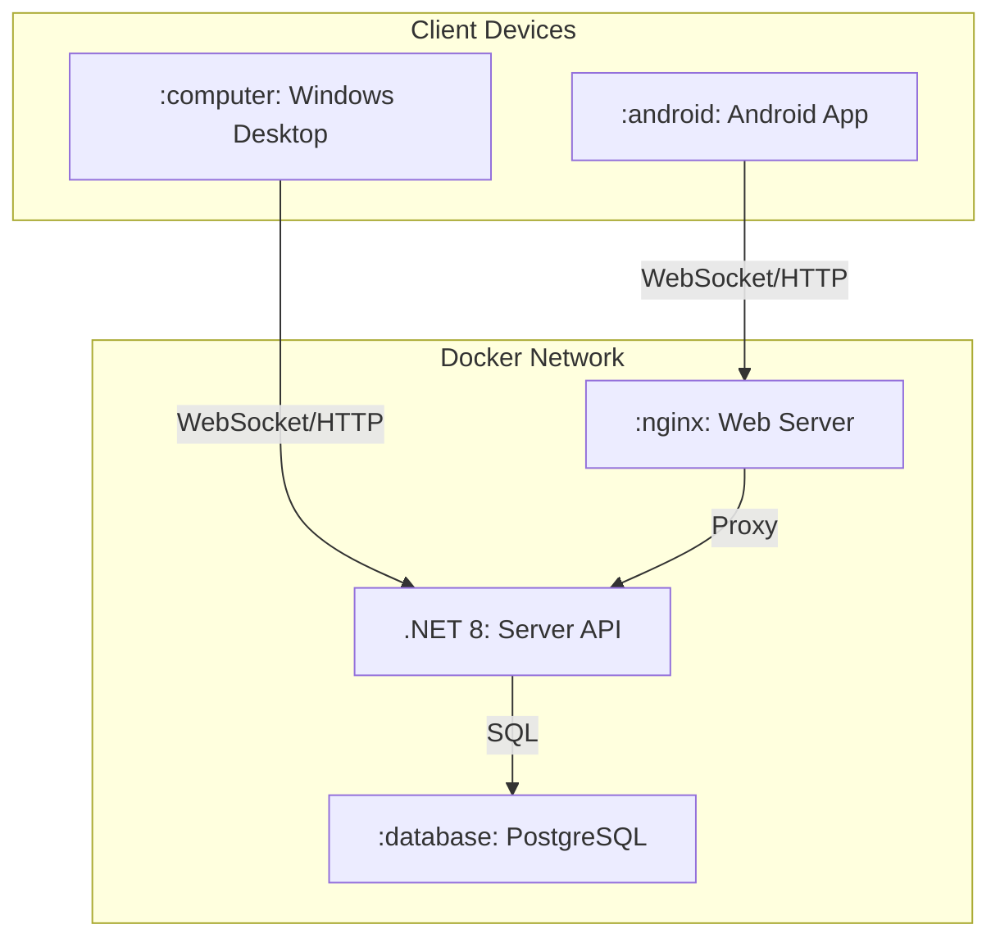

# NeonLink - Полная архитектура и план разработки

## 1. Архитектура системы

### 1.1 Компоненты системы



### 1.2 Docker Compose сервисы

| Сервис | Порт | Описание |
|--------|------|----------|
| `postgres` | 5432 | База данных PostgreSQL |
| `server` | 9876, 9877 | .NET 8 WebSocket API сервер |
| `flutter-builder` | - | Сборка Android APK |
| `web` | 80, 443 | Nginx для Flutter Web (опционально) |

---

## 2. План работ

### 2.1 Инфраструктура Docker

- [ ] Обновить `docker-compose.yml` с отдельными сервисами:
  - [ ] PostgreSQL с volumes для данных
  - [ ] Server (.NET 8) с подключением к PostgreSQL
  - [ ] Flutter Builder для Android APK
- [ ] Создать Dockerfile для PostgreSQL инициализации (миграции)
- [ ] Настроить сеть между сервисами
- [ ] Добавить healthcheck для всех сервисов

### 2.2 Серверная часть (.NET)

- [ ] Добавить Npgsql (PostgreSQL драйвер)
- [ ] Создать модели данных для PostgreSQL
- [ ] Реализовать DbContext и миграции
- [ ] Обновить сервисы для работы с БД:
  - [ ] SensorService - запись в PostgreSQL
  - [ ] CacheService - кэширование запросов
  - [ ] TelemetryChannelService - потоковая передача
- [ ] Оптимизация производительности:
  - [ ] Использовать connection pooling
  - [ ] Асинхронные операции I/O
  - [ ] Кэширование часто запрашиваемых данных

### 2.3 Desktop приложение (Windows)

- [ ] Создать Windows установщик:
  - [ ] PyInstaller для создания .exe
  - [ ] NSIS или Inno Setup для инсталлятора
- [ ] Интерфейс установщика скриптов:
  - [ ] Загрузка/выгрузка скриптов
  - [ ] Настройка параметров выполнения
  - [ ] Логирование выполнения
- [ ] Панель мониторинга:
  - [ ] Отображение статусов подключений
  - [ ] Мониторинг портов
  - [ ] Управление сервером
- [ ] Контейнеризация:
  - [ ] Убрать глобальные pip install
  - [ ] Использовать venv или Docker для сборки

### 2.4 Android приложение (Flutter)

- [ ] Обновить Dockerfile для Android сборки:
  - [ ] Android SDK
  - [ ] Сборка debug APK
- [ ] Настроить подключение к серверу через WebSocket

### 2.5 Оптимизация и исправления

- [ ] Исправить критические ошибки в проекте:
  - [ ] Проверить конфликты зависимостей
  - [ ] Исправить проблемы совместимости
- [ ] Оптимизация кода:
  - [ ] Убрать избыточные зависимости
  - [ ] Оптимизировать размер Docker образов
  - [ ] Использовать multi-stage builds

---

## 3. Структура Docker Compose

```yaml
version: '3.8'

services:
  postgres:
    image: postgres:15-alpine
    environment:
      POSTGRES_DB: neonlink
      POSTGRES_USER: neonlink
      POSTGRES_PASSWORD: ${POSTGRES_PASSWORD}
    volumes:
      - postgres_data:/var/lib/postgresql/data
      - ./docker/postgres/init:/docker-entrypoint-initdb.d
    healthcheck:
      test: ["CMD-SHELL", "pg_isready -U neonlink"]
      interval: 10s
      timeout: 5s
      retries: 5

  server:
    build:
      context: .
      dockerfile: docker/server.Dockerfile
    ports:
      - "9876:9876"
      - "9877:9877"
    depends_on:
      postgres:
        condition: service_healthy
    environment:
      - ConnectionStrings__DefaultConnection=Host=postgres;Database=neonlink;Username=neonlink;Password=${POSTGRES_PASSWORD}
      - ASPNETCORE_ENVIRONMENT=Docker
    healthcheck:
      test: ["CMD", "curl", "-f", "http://localhost:9876/health"]
      interval: 30s
      timeout: 10s
      retries: 3

  flutter-builder:
    build:
      context: .
      dockerfile: docker/flutter-android.Dockerfile
    volumes:
      - ./output:/output

volumes:
  postgres_data:
```

---

## 4. Приоритеты реализации

### Фаза 1: Инфраструктура (высокий приоритет)
1. Обновить docker-compose.yml
2. Настроить PostgreSQL
3. Подключить сервер к БД

### Фаза 2: Desktop приложение (высокий приоритет)
1. Создать Windows .exe через PyInstaller
2. Реализовать интерфейс установщика
3. Добавить мониторинг портов и статусов

### Фаза 3: Android приложение (средний приоритет)
1. Настроить Docker сборку Android APK
2. Проверить подключение к серверу

### Фаза 4: Оптимизация (низкий приоритет)
1. Профилирование и оптимизация
2. Уменьшение размера образов
