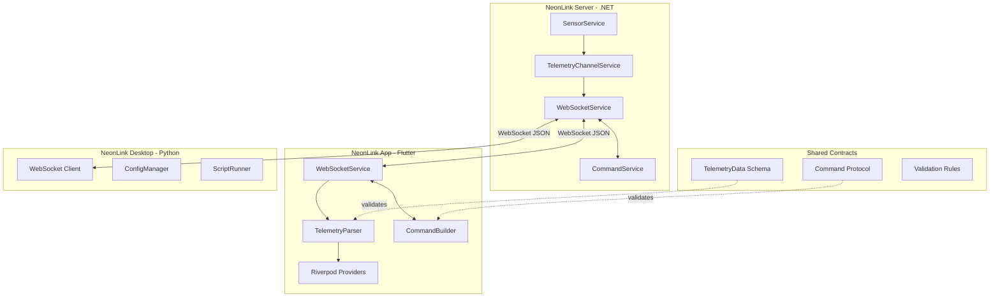

# NeonLink - План Интеграции и Синхронизации Компонентов

## Выявленные Проблемы

### 1. КРИТИЧНО: Рассинхронизация моделей данных

Сервер (.NET) и клиент (Flutter) используют **разные структуры данных**:

| Компонент | Сервер (C#) | Клиент (Flutter) | Проблема |
|-----------|-------------|------------------|----------|
| **CpuInfo** | `cores: List<CpuCoreInfo>` | `cores: int` | Несовместимые типы |
| **CpuInfo** | `clock: double` | `clockSpeed: double` | Разные имена полей |
| **GpuInfo** | `vramUsed, vramTotal: double` | `memory, vram: int` | Разные имена и типы |
| **RamInfo** | `used, total: double` | `usedGb, totalGb: double` | Разные имена |
| **StorageInfo** | `name, temp, health, smart` | `usedPercent, usedGb, totalGb, readSpeed, writeSpeed` | Полностью разные структуры |
| **NetworkInfo** | `download, upload: double` | `downloadSpeed, uploadSpeed: int` | Разные имена и типы |
| **SystemInfo** | `storage: List<StorageInfo>` | `storage: StorageInfo` | Список vs одиночный объект |

### 2. Отсутствие единой спецификации API

- Нет документа, описывающего WebSocket протокол
- Команды не документированы на стороне клиента
- Нет схемы валидации JSON

### 3. Проблемы в WebSocket сервисе Flutter

```dart
// Проблема: currentStatus не отражает реальное состояние
ConnectionStatus get currentStatus => _statusController.hasListener 
    ? ConnectionStatus.connected 
    : ConnectionStatus.disconnected;
```

### 4. Отсутствие обработки ошибок десериализации

```dart
void _onMessage(dynamic message) {
  try {
    final data = TelemetryData.fromJson(jsonDecode(message));
    _messageController.add(data);
  } catch (e) {
    debugPrint('Telemetry parse error: $e');
    // Ошибка проглатывается, клиент не уведомляется
  }
}
```

---

## Архитектура Интеграции



---

## План Доработки

### Этап 1: Унификация моделей данных

#### 1.1 Создание общей спецификации TelemetryData

**Файл:** `docs/api/telemetry-schema.json`

```json
{
  "$schema": "http://json-schema.org/draft-07/schema#",
  "title": "TelemetryData",
  "type": "object",
  "required": ["timestamp", "system"],
  "properties": {
    "timestamp": { "type": "integer" },
    "system": { "$ref": "#/definitions/SystemInfo" },
    "gaming": { "$ref": "#/definitions/GamingInfo" },
    "adminLevel": { "type": "string" }
  },
  "definitions": {
    "SystemInfo": {
      "type": "object",
      "required": ["cpu", "gpu", "ram", "storage", "network"],
      "properties": {
        "cpu": { "$ref": "#/definitions/CpuInfo" },
        "gpu": { "$ref": "#/definitions/GpuInfo" },
        "ram": { "$ref": "#/definitions/RamInfo" },
        "storage": { "type": "array", "items": { "$ref": "#/definitions/StorageInfo" } },
        "network": { "$ref": "#/definitions/NetworkInfo" }
      }
    },
    "CpuInfo": {
      "type": "object",
      "required": ["name", "usage", "temp", "clock"],
      "properties": {
        "name": { "type": "string" },
        "usage": { "type": "number", "minimum": 0, "maximum": 100 },
        "temp": { "type": "number" },
        "clock": { "type": "number" },
        "power": { "type": ["number", "null"] },
        "cores": { "type": "array", "items": { "$ref": "#/definitions/CpuCoreInfo" } }
      }
    },
    "CpuCoreInfo": {
      "type": "object",
      "properties": {
        "id": { "type": "integer" },
        "usage": { "type": "number" },
        "temp": { "type": ["number", "null"] },
        "clock": { "type": ["number", "null"] }
      }
    },
    "GpuInfo": {
      "type": "object",
      "required": ["name", "usage", "temp"],
      "properties": {
        "name": { "type": "string" },
        "type": { "type": "string", "enum": ["NVIDIA", "AMD", "Intel"] },
        "usage": { "type": "number", "minimum": 0, "maximum": 100 },
        "temp": { "type": "number" },
        "vramUsed": { "type": "number" },
        "vramTotal": { "type": "number" },
        "clock": { "type": "number" },
        "memoryClock": { "type": ["number", "null"] },
        "power": { "type": ["number", "null"] },
        "fanSpeed": { "type": ["integer", "null"] }
      }
    },
    "RamInfo": {
      "type": "object",
      "required": ["used", "total"],
      "properties": {
        "used": { "type": "number" },
        "total": { "type": "number" },
        "available": { "type": "number" },
        "usedPercent": { "type": "number" },
        "speed": { "type": ["integer", "null"] }
      }
    },
    "StorageInfo": {
      "type": "object",
      "required": ["name"],
      "properties": {
        "name": { "type": "string" },
        "temp": { "type": ["number", "null"] },
        "health": { "type": ["integer", "null"] },
        "smart": { "$ref": "#/definitions/StorageSmartData" }
      }
    },
    "StorageSmartData": {
      "type": "object",
      "properties": {
        "tbw": { "type": ["integer", "null"] },
        "powerOnHours": { "type": ["integer", "null"] },
        "reallocatedSectors": { "type": ["integer", "null"] }
      }
    },
    "NetworkInfo": {
      "type": "object",
      "properties": {
        "download": { "type": "number" },
        "upload": { "type": "number" },
        "ping": { "type": "integer" },
        "ip": { "type": ["string", "null"] }
      }
    },
    "GamingInfo": {
      "type": "object",
      "properties": {
        "active": { "type": "boolean" },
        "fps": { "type": ["integer", "null"] },
        "fps1Low": { "type": ["integer", "null"] },
        "frametime": { "type": ["number", "null"] },
        "activeProcess": { "type": ["string", "null"] }
      }
    }
  }
}
```

#### 1.2 Обновление Flutter моделей

**Файл:** `neonlink_app/lib/data/models/telemetry_data.dart`

Необходимо привести в полное соответствие с серверными моделями:

- Добавить поле `name` в `CpuInfo` и `GpuInfo`
- Изменить `cores` с `int` на `List<CpuCoreInfo>`
- Добавить недостающие поля: `power`, `memoryClock`, `fanSpeed`
- Унифицировать имена полей: `clock` вместо `clockSpeed`
- Изменить `storage` с одиночного объекта на `List<StorageInfo>`
- Унифицировать `RamInfo`: добавить `used`, `total`, `available`

#### 1.3 Создание генератора моделей

**Файл:** `tools/generate_models.dart`

Скрипт для генерации Dart моделей из JSON Schema.

---

### Этап 2: Унификация протокола команд

#### 2.1 Спецификация команд

**Файл:** `docs/api/command-protocol.md`

| Команда | Параметры | Ответ | Описание |
|---------|-----------|-------|----------|
| `ping` | - | `{ pong: true, timestamp: number }` | Проверка соединения |
| `get_status` | - | `GetStatusResult` | Статус сервера |
| `get_telemetry` | - | `{ streaming: true }` | Запуск потока телеметрии |
| `get_config` | `section?: string` | `GetConfigResult` | Получение конфигурации |
| `set_polling_interval` | `intervalMs: number` | `{ success: boolean, intervalMs: number }` | Изменение интервала |
| `rgb_effect` | `effect, color, speed?, brightness?` | `{ success: boolean }` | Управление RGB |
| `set_fan_speed` | `profile, fan?, speed?` | `{ success: boolean }` | Управление вентиляторами |

#### 2.2 Создание CommandBuilder на Flutter

**Файл:** `neonlink_app/lib/services/command_builder.dart`

```dart
class CommandBuilder {
  static String ping() => jsonEncode({'command': 'ping'});
  
  static String getStatus() => jsonEncode({'command': 'get_status'});
  
  static String getTelemetry() => jsonEncode({'command': 'get_telemetry'});
  
  static String setPollingInterval(int intervalMs) => jsonEncode({
    'command': 'set_polling_interval',
    'params': {'intervalMs': intervalMs},
  });
  
  static String rgbEffect({
    required String effect,
    required String color,
    int? speed,
    int? brightness,
  }) => jsonEncode({
    'command': 'rgb_effect',
    'params': {
      'effect': effect,
      'color': color,
      if (speed != null) 'speed': speed,
      if (brightness != null) 'brightness': brightness,
    },
  });
}
```

---

### Этап 3: Рефакторинг WebSocket сервиса Flutter

#### 3.1 Исправление определения статуса

```dart
class WebSocketService {
  ConnectionStatus _currentStatus = ConnectionStatus.disconnected;
  
  ConnectionStatus get currentStatus => _currentStatus;
  
  // Обновлять статус при изменениях
  void _updateStatus(ConnectionStatus status) {
    _currentStatus = status;
    _statusController.add(status);
  }
}
```

#### 3.2 Добавление обработки ошибок

```dart
class TelemetryParseResult {
  final TelemetryData? data;
  final String? error;
  final bool success;
  
  TelemetryParseResult.success(this.data) 
    : error = null, success = true;
  TelemetryParseResult.error(this.error) 
    : data = null, success = false;
}

class WebSocketService {
  final _errorController = StreamController<String>.broadcast();
  Stream<String> get errorStream => _errorController.stream;
  
  void _onMessage(dynamic message) {
    try {
      final json = jsonDecode(message);
      
      // Проверка типа сообщения
      if (json is Map<String, dynamic> && json.containsKey('success')) {
        // Это ответ на команду
        _handleCommandResponse(json);
      } else {
        // Это телеметрия
        final data = TelemetryData.fromJson(json);
        _messageController.add(data);
      }
    } catch (e) {
      _errorController.add('Parse error: $e');
      debugPrint('Telemetry parse error: $e');
    }
  }
}
```

#### 3.3 Добавление таймаута для команд

```dart
Future<T> sendCommand<T>(
  String command, {
  Duration timeout = const Duration(seconds: 10),
  T Function(Map<String, dynamic>)? parser,
}) async {
  final completer = Completer<T>();
  
  // Подписка на ответ
  late StreamSubscription sub;
  sub = _responseStream.listen((response) {
    if (response['command'] == command) {
      sub.cancel();
      if (response['success'] == true) {
        completer.complete(parser?.call(response) ?? response['result'] as T);
      } else {
        completer.completeError(Exception(response['error']));
      }
    }
  });
  
  // Отправка команды
  _channel?.sink.add(jsonEncode({'command': command}));
  
  // Таймаут
  return completer.future.timeout(timeout, onTimeout: () {
    sub.cancel();
    throw TimeoutException('Command $command timed out');
  });
}
```

---

### Этап 4: Оптимизация серверной части

#### 4.1 Улучшение TelemetryChannelService

**Проблема:** Нет backpressure при медленных клиентах.

**Решение:** Добавить Bounded channel с drop стратегией:

```csharp
public class TelemetryChannelService
{
    private readonly Channel<TelemetryData> _channel;
    
    public TelemetryChannelService()
    {
        var options = new BoundedChannelOptions(100)
        {
            FullMode = BoundedChannelFullMode.DropOldest,
            SingleReader = false,
            SingleWriter = true
        };
        
        _channel = Channel.CreateBounded<TelemetryData>(options);
    }
}
```

#### 4.2 Добавление версионирования API

```csharp
public class TelemetryData
{
    [JsonPropertyName("version")]
    public string Version { get; set; } = "1.0.0";
    
    // ... rest of properties
}
```

#### 4.3 Добавление heartbeat на сервер

```csharp
// В WebSocketService
private async Task SendHeartbeatAsync(WebSocket socket, string clientId)
{
    while (!_cts.Token.IsCancellationRequested && socket.State == WebSocketState.Open)
    {
        await Task.Delay(30000, _cts.Token);
        
        var heartbeat = new { type = "heartbeat", timestamp = DateTimeOffset.UtcNow.ToUnixTimeSeconds() };
        await SendMessageAsync(socket, clientId, JsonHelper.Serialize(heartbeat));
    }
}
```

---

### Этап 5: Интеграционные тесты

#### 5.1 Тест синхронизации моделей

**Файл:** `tests/integration/model_sync_test.dart`

```dart
test('Server TelemetryData should parse correctly in Flutter', () {
  // Arrange - пример данных от сервера
  final serverJson = {
    'timestamp': 1234567890,
    'system': {
      'cpu': {
        'name': 'AMD Ryzen 9 5900X',
        'usage': 45.5,
        'temp': 65.0,
        'clock': 4200.0,
        'cores': [
          {'id': 0, 'usage': 50.0},
          {'id': 1, 'usage': 40.0}
        ]
      },
      'gpu': {
        'name': 'NVIDIA RTX 4090',
        'type': 'NVIDIA',
        'usage': 75.0,
        'temp': 70.0,
        'vramUsed': 12.5,
        'vramTotal': 24.0
      },
      'ram': {
        'used': 16.0,
        'total': 32.0
      },
      'storage': [
        {'name': 'Samsung 990 Pro', 'temp': 45.0}
      ],
      'network': {
        'download': 100.0,
        'upload': 50.0
      }
    }
  };
  
  // Act
  final telemetry = TelemetryData.fromJson(serverJson);
  
  // Assert
  expect(telemetry.system.cpu.name, 'AMD Ryzen 9 5900X');
  expect(telemetry.system.cpu.cores, hasLength(2));
  expect(telemetry.system.storage, hasLength(1));
});
```

#### 5.2 Тест WebSocket протокола

**Файл:** `tests/integration/websocket_protocol_test.cs`

```csharp
[Fact]
public async Task WebSocket_PingCommand_ReturnsPong()
{
    // Arrange
    var server = new TestServer();
    var client = await server.ConnectClientAsync();
    
    // Act
    await client.SendAsync("{\"command\":\"ping\"}");
    var response = await client.ReceiveAsync();
    
    // Assert
    Assert.Contains("pong", response);
    Assert.Contains("timestamp", response);
}
```

---

### Этап 6: Документация

#### 6.1 Структура документации

```
docs/
├── api/
│   ├── telemetry-schema.json      # JSON Schema телеметрии
│   ├── command-protocol.md        # Протокол команд
│   └── websocket-api.md           # WebSocket API документация
├── architecture/
│   ├── system-overview.md         # Обзор системы
│   └── data-flow.md               # Потоки данных
└── integration/
    ├── flutter-client.md          # Интеграция Flutter
    └── desktop-client.md          # Интеграция Desktop
```

#### 6.2 Шаблон документации изменений

```markdown
# NeonLink Changelog

## [Unreleased]

### Added
- JSON Schema для валидации телеметрии
- CommandBuilder для типизированных команд
- Heartbeat механизм для WebSocket

### Changed
- **BREAKING**: Модели TelemetryData синхронизированы между сервером и клиентом
- **BREAKING**: StorageInfo теперь List вместо одиночного объекта
- Улучшена обработка ошибок десериализации

### Fixed
- Исправлено определение статуса соединения в WebSocketService
- Добавлен backpressure в TelemetryChannelService

### Security
- Валидация всех входящих JSON сообщений
```

---

## Метрики Успеха

| Метрика | Текущее | Целевое |
|---------|---------|---------|
| Синхронизация моделей | 0% | 100% |
| Покрытие интеграционных тестов | 0% | 80% |
| Документация API | 0% | 100% |
| Обработка ошибок WebSocket | Частично | Полностью |
| Валидация входящих данных | Нет | JSON Schema |

---

## Приоритеты Реализации

1. **Критично:** Синхронизация моделей данных (без этого не работает)
2. **Высокий:** Исправление WebSocketService Flutter
3. **Высокий:** Добавление валидации
4. **Средний:** Оптимизация серверной части
5. **Средний:** Интеграционные тесты
6. **Низкий:** Документация (можно параллельно)
