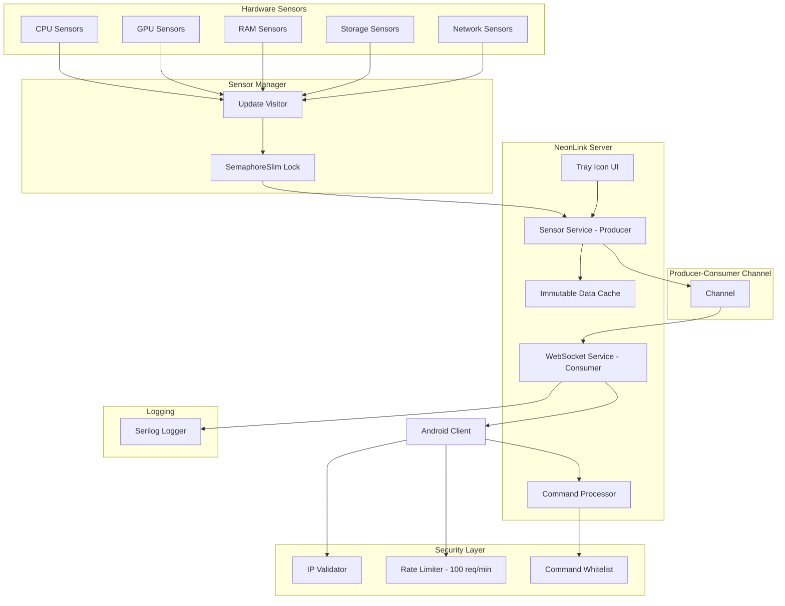

# NeonLink Windows Server - План Разработки v2.0

## Архитектура Системы



## Структура Проекта

```
NeonLink/
├── src/
│   ├── NeonLink.Server/
│   │   ├── Program.cs              # Entry point, service configuration
│   │   ├── Models/
│   │   │   ├── TelemetryData.cs   # JSON serialization models
│   │   │   ├── CommandModels.cs   # Incoming command models
│   │   │   ├── HardwareInfo.cs    # Cached hardware info
│   │   │   └── GamingInfo.cs      # Gaming mode data
│   │   ├── Services/
│   │   │   ├── SensorService.cs   # LibreHardwareMonitor wrapper + Producer
│   │   │   ├── WebSocketService.cs # WebSocket server + Consumer
│   │   │   ├── CommandService.cs  # Command processor with whitelist
│   │   │   ├── CacheService.cs   # Immutable data caching
│   │   │   ├── NetworkService.cs  # mDNS broadcast + Ping
│   │   │   ├── GamingService.cs   # Gaming mode detection
│   │   │   └── SecurityService.cs # IP validation, rate limiting
│   │   ├── UI/
│   │   │   ├── MainWindow.xaml    # Hidden/minimized window
│   │   │   └── TrayIcon.cs        # H.NotifyIcon wrapper
│   │   ├── Configuration/
│   │   │   ├── Settings.cs        # appsettings.json models
│   │   │   └── SecurityConfig.cs   # Security settings
│   │   ├── Utilities/
│   │   │   ├── JsonHelper.cs      # Custom JSON serialization options
│   │   │   ├── ThreadSafeHelper.cs # SemaphoreSlim wrappers
│   │   │   └── WmiHelper.cs       # WMI queries for SMART data
│   │   ├── NeonLink.Server.csproj
│   │   └── appsettings.json
│   │
│   └── NeonLink.Shared/
│       ├── Protocols/
│       │   └── Messages.proto      # Protobuf schemas
│       └── NeonLink.Shared.csproj
│
├── tests/
│   └── NeonLink.Server.Tests/
│       ├── SensorServiceTests.cs
│       ├── WebSocketServiceTests.cs
│       ├── CommandServiceTests.cs
│       └── NeonLink.Server.Tests.csproj
│
├── scripts/
│   ├── build.ps1                   # Release build script
│   ├── install-service.ps1          # Service installation
│   └── run-tests.ps1               # Test runner
│
├── .gitignore
├── README.md
├── LICENSE
└── NeonLink.sln
```

## Детальный План Задач

### Этап 1: Foundation (Setup) - ИСПРАВЛЕНО

#### 1.1 Создание Проекта
- [ ] Создать solution `NeonLink.sln`
- [ ] Добавить проект `NeonLink.Server` (.NET 8, Console App)
- [ ] Добавить проект `NeonLink.Shared` (Class Library)
- [ ] Настроить Directory.Build.props для统一 версий
- [ ] Настроить NuGet пакеты:
  - `LibreHardwareMonitorLib` (собирать из source)
  - `Serilog.AspNetCore`
  - `H.NotifyIcon.Wpf` (ИСПРАВЛЕНО: заменен Hardcodet → H.NotifyIcon)
  - `Makaretu.Dns.Multicast` (ИСПРАВЛЕНО: для mDNS)
  - `System.Text.Json` (встроенный)
  - `System.Threading.Channels` (для Producer-Consumer)

#### 1.2 Graceful Degradation (НОВОЕ)
- [ ] Создать `AdminRightsChecker.cs`:
  ```csharp
  public static class AdminRightsChecker
  {
      public static bool IsRunningAsAdmin()
      {
          return new WindowsPrincipal(WindowsIdentity.GetCurrent())
              .IsInRole(WindowsBuiltInRole.Administrator);
      }

      public static AdminLevel CheckAdminLevel()
      {
          if (IsRunningAsAdmin())
              return AdminLevel.Full;
          
          // Проверяем доступ к WMI
          try
          {
              using var wmi = new ManagementObjectSearcher(
                  "SELECT * FROM Win32_OperatingSystem");
              wmi.Get();
              return AdminLevel.Limited;
          }
          catch
          {
              return AdminLevel.Minimal;
          }
      }
  }

  public enum AdminLevel
  {
      Full,       // Все сенсоры доступны
      Limited,    // CPU, GPU, RAM (без fan control)
      Minimal     // Только базовые метрики
  }
  ```
- [ ] При старте проверять уровень прав
- [ ] Логировать предупреждение если нет прав админа
- [ ] Уменьшать функционал gracefully:
  - Full → Limited: отключить fan control
  - Limited → Minimal: упрощенные метрики

#### 1.3 JSON Serialization (НОВОЕ - детализировано)
- [ ] Создать `Utilities/JsonHelper.cs`:
  ```csharp
  public static class JsonHelper
  {
      public static readonly JsonSerializerOptions Options = new()
      {
          PropertyNamingPolicy = JsonNamingPolicy.CamelCase,
          DefaultIgnoreCondition = JsonIgnoreCondition.WhenWritingNull,
          WriteIndented = false, // Компактный JSON для WebSocket
          PropertyNameCaseInsensitive = true,
          Converters = { new JsonStringEnumConverter() }
      };

      public static string Serialize<T>(T data)
      {
          return JsonSerializer.Serialize(data, Options);
      }

      public static T? Deserialize<T>(string json)
      {
          return JsonSerializer.Deserialize<T>(json, Options);
      }
  }
  ```

#### 1.4 Модели Данных
- [ ] Создать `Models/TelemetryData.cs`:
  ```csharp
  public class TelemetryData
  {
      public long Timestamp { get; set; }
      public SystemInfo System { get; set; }
      public GamingInfo Gaming { get; set; }
      public AdminLevel AdminLevel { get; set; } // Для клиента
  }

  public class SystemInfo
  {
      public CpuInfo Cpu { get; set; }
      public GpuInfo Gpu { get; set; }
      public RamInfo Ram { get; set; }
      public List<StorageInfo> Storage { get; set; }
      public NetworkInfo Network { get; set; }
  }
  ```
- [ ] Создать `Models/CommandModels.cs` для входящих команд
- [ ] Создать `Models/HardwareInfo.cs` для кешированных данных
- [ ] Создать `Models/GamingInfo.cs` (НОВОЕ):
  ```csharp
  public class GamingInfo
  {
      public bool IsActive { get; set; }
      public int? Fps { get; set; }
      public int? Fps1Low { get; set; }
      public double? Frametime { get; set; }
      public string? ActiveProcess { get; set; }
  }
  ```

---

### Этап 2: Sensor Manager - ИСПРАВЛЕНО

#### 2.1 LibreHardwareMonitor Интеграция
- [ ] Создать `Services/SensorService.cs`
- [ ] Реализовать `UpdateVisitor` для паттерна visitor
- [ ] Инициализировать `Computer` с включенными сенсорами
- [ ] Реализовать метод `UpdateSensors()` с циклом обновления

#### 2.2 Thread-Safety (НОВОЕ - критично)
- [ ] Обернуть ALL обращения к Computer в SemaphoreSlim:
  ```csharp
  private readonly SemaphoreSlim _lock = new(1, 1);
  private readonly Computer _computer;

  public async Task<TelemetryData> GetCurrentTelemetryAsync()
  {
      await _lock.WaitAsync();
      try
      {
          // ТОЛЬКО внутри lock
          foreach (var hardware in _computer.Hardware)
              hardware.Update();
          return ExtractData();
      }
      finally
      {
          _lock.Release();
      }
  }
  ```
- [ ] Использовать async-friendly lock (не lock(), а SemaphoreSlim)
- [ ] Тест: запустить 10 параллельных вызовов без race conditions

#### 2.3 Извлечение Метрик CPU/GPU/RAM/Storage
- [ ] Получить имя CPU, GPU, RAM total
- [ ] Извлечь температуру, загрузку, частоту
- [ ] Извлечь данные по ядрам CPU

#### 2.4 Storage SMART Атрибуты (НОВОЕ)
- [ ] Создать `Utilities/WmiHelper.cs`:
  ```csharp
  public static class WmiHelper
  {
      public static async Task<StorageSmartData> GetStorageSmartDataAsync(string drive)
      {
          // WMI query для SMART атрибутов
          var query = $"SELECT * FROM Win32_DiskDrive WHERE Model LIKE '%{drive}%'";
          // Получить TBW, PowerOnHours, ReallocatedSectors
      }
  }

  public class StorageSmartData
  {
      public int? Tbw { get; set; }         // Total Bytes Written
      public int? PowerOnHours { get; set; }
      public int? ReallocatedSectors { get; set; }
      public int? Temperature { get; set; }
  }
  ```
- [ ] Интегрировать в `StorageInfo`:
  ```csharp
  public class StorageInfo
  {
      public string Name { get; set; }
      public double? Temp { get; set; }
      public int? HealthPercent { get; set; }
      public StorageSmartData? Smart { get; set; }
  }
  ```

#### 2.5 Network Ping (НОВОЕ - критично)
- [ ] Создать `NetworkService.cs` с отдельным ping:
  ```csharp
  public class NetworkService
  {
      private readonly SemaphoreSlim _pingLock = new(1, 1);
      private int _cachedPing = -1;
      private DateTime _lastPingTime;

      public async Task<int> GetPingAsync()
      {
          await _pingLock.WaitAsync();
          try
          {
              // Пинговать не чаще 1 раза в 5 секунд
              if ((DateTime.UtcNow - _lastPingTime).TotalSeconds < 5)
                  return _cachedPing;

              using var ping = new Ping();
              try
              {
                  var reply = await ping.SendPingAsync("8.8.8.8", timeout: 1000);
                  _cachedPing = (int)reply.RoundtripTime;
              }
              catch
              {
                  _cachedPing = -1;
              }
              _lastPingTime = DateTime.UtcNow;
              return _cachedPing;
          }
          finally
          {
              _pingLock.Release();
          }
      }
  }
  ```

#### 2.6 Gaming Mode Detection (НОВОЕ)
- [ ] Создать `Services/GamingService.cs`:
  ```csharp
  public class GamingService
  {
      private readonly List<string> _gamingProcesses = new()
      {
          "cs2.exe", "RDR2.exe", "eldenring.exe", "gow.exe",
          "valorant.exe", "fortnite.exe", "apexlegends.exe"
      };

      public GamingInfo DetectGamingMode(float cpuLoad, float gpuLoad)
      {
          var activeProcess = GetActiveGameProcess();
          var isGaming = activeProcess != null || 
                         (gpuLoad > 85f && cpuLoad > 40f); // GPU heuristic

          return new GamingInfo
          {
              IsActive = isGaming,
              ActiveProcess = activeProcess,
              // FPS estimate через GPU load heuristic
              Fps = isGaming ? EstimateFps(gpuLoad) : null,
              Fps1Low = isGaming ? EstimateFps1Low(gpuLoad) : null,
              Frametime = isGaming ? 1000.0 / EstimateFps(gpuLoad) : null
          };
      }

      private string? GetActiveGameProcess()
      {
          return Process.GetProcesses()
              .FirstOrDefault(p => _gamingProcesses.Contains(p.ProcessName))
              ?.ProcessName;
      }
  }
  ```

#### 2.7 Polling Loop
- [ ] Реализовать `StartPolling(int intervalMs = 500)`
- [ ] Использовать `System.Threading.Timer`
- [ ] Thread-safety через lock (уже добавлен в 2.2)
- [ ] Event-based обновления для UI

---

### Этап 3: Producer-Consumer Channel (НОВОЕ - критично)

#### 3.1 Channel<T> Реализация
- [ ] Создать `Services/TelemetryChannelService.cs`:
  ```csharp
  public class TelemetryChannelService
  {
      private readonly Channel<TelemetryData> _channel;
      private readonly CancellationTokenSource _cts;

      public TelemetryChannelService()
      {
          // Bounded channel для backpressure
          _channel = Channel.CreateBounded<TelemetryData>(100);
          _cts = new CancellationTokenSource();
      }

      // Producer: SensorService
      public async Task WriteTelemetryAsync(TelemetryData data)
      {
          await _channel.Writer.WriteAsync(data);
      }

      // Consumer: WebSocketService
      public IAsyncEnumerable<TelemetryData> ReadAllAsync(
          [EnumeratorCancellation] CancellationToken ct = default)
      {
          return _channel.Reader.ReadAllAsync(ct);
      }

      public void Dispose()
      {
          _cts.Cancel();
          _channel.Writer.Complete();
      }
  }
  ```

#### 3.2 Интеграция Sensor + WebSocket
- [ ] SensorService → Producer → Channel
- [ ] WebSocketService → Consumer → Channel
- [ ] Тест: 1000 messages без потерь

---

### Этап 4: WebSocket Server - ИСПРАВЛЕНО

#### 4.1 Конкретная Реализация (ИСПРАВЛЕНО)
- [ ] Создать `Services/WebSocketService.cs`:
  ```csharp
  public class WebSocketService
  {
      private readonly WebApplication _app;
      private readonly ILogger<WebSocketService> _logger;

      public WebSocketService(ILogger<WebSocketService> logger)
      {
          var builder = WebApplication.CreateBuilder();
          builder.Services.AddCors(o => o.AddPolicy("AllowAll", p => 
              p.AllowAnyOrigin().AllowAnyMethod().AllowAnyHeader()));
          
          _app = builder.Build();
          _app.UseCors("AllowAll");
          _app.UseWebSockets();
          
          _logger = logger;
      }

      public void MapEndpoints()
      {
          _app.Map("/ws", async (HttpContext context) =>
          {
              if (context.WebSockets.IsWebSocketRequest)
              {
                  using var socket = await context.WebSockets.AcceptWebSocketAsync();
                  await HandleConnectionAsync(socket);
              }
              else
              {
                  context.Response.StatusCode = 400;
              }
          });
      }

      private async Task HandleConnectionAsync(WebSocket socket)
      {
          // Consumer loop из Channel
      }
  }
  ```

#### 4.2 Управление Подключениями
- [ ] Хранить активные подключения в `ConcurrentDictionary<string, WebSocket>`
- [ ] Присваивать уникальный ID каждому клиенту
- [ ] Heartbeat для детекта disconnect
- [ ] Ограничить до 5 одновременных подключений

#### 4.3 Broadcasting Телеметрии
- [ ] При получении данных из Channel → broadcast всем клиентам
- [ ] Обрабатывать ошибки отправки
- [ ] Буферизация при high load

#### 4.4 mDNS Broadcast (ИСПРАВЛЕНО)
- [ ] Создать `Services/NetworkService.cs`:
  ```csharp
  using Makaretu.Dns;

  public class NetworkService
  {
      private ServiceDiscovery? _sd;

      public void AdvertiseService(string ip, int port)
      {
          _sd = new ServiceDiscovery();
          _sd.Advertise(new ServiceProfile(
              instanceName: Environment.MachineName,
              serviceName: "_neonlink._tcp",
              port: port,
              addresses: new[] { IPAddress.Parse(ip) }
          ));
      }
  }
  ```

---

### Этап 5: Security - ИСПРАВЛЕНО (убрано "опционально")

#### 5.1 IP Validation (ОБЯЗАТЕЛЬНО)
- [ ] Создать `Services/SecurityService.cs`:
  ```csharp
  public static class SecurityService
  {
      public static bool IsPrivateIP(IPAddress ip)
      {
          var bytes = ip.GetAddressBytes();
          return bytes[0] == 10 ||
                 (bytes[0] == 172 && bytes[1] >= 16 && bytes[1] <= 31) ||
                 (bytes[0] == 192 && bytes[1] == 168);
      }

      public static bool IsConnectionAllowed(string remoteIp)
      {
          if (!IPAddress.TryParse(remoteIp, out var ip))
              return false;
          return IsPrivateIP(ip); // ТОЛЬКО локальная сеть
      }
  }
  ```

#### 5.2 Rate Limiting (ОБЯЗАТЕЛЬНО - 100 req/min)
- [ ] Реализовать sliding window:
  ```csharp
  private readonly ConcurrentDictionary<string, List<DateTime>> _requestLog = new();

  public bool IsRateLimited(string clientId)
  {
      var now = DateTime.UtcNow;
      var window = _requestLog.GetOrAdd(clientId, _ => new());
      
      // Удалить старые записи (> 1 минута)
      lock (window)
      {
          window.RemoveAll(t => (now - t).TotalMinutes > 1);
          var count = window.Count;
          window.Add(now);
          return count >= 100;
      }
  }
  ```

#### 5.3 Command Whitelist (ОБЯЗАТЕЛЬНО)
- [ ] Создать `Models/AllowedCommands.cs`:
  ```csharp
  public static class AllowedCommands
  {
      // Безопасные команды - разрешены по умолчанию
      public static readonly HashSet<string> Safe = new()
      {
          "get_status",
          "ping",
          "get_config",
          "set_polling_interval"
      };

      // Опасные команды - требуют explicit permission
      public static readonly HashSet<string> Dangerous = new()
      {
          "shutdown",
          "restart",
          "execute"
      };
  }
  ```

#### 5.4 Graceful Error Handling
- [ ] Не показывать stack traces клиенту
- [ ] Логировать полные ошибки локально
- [ ] Возвращать user-friendly сообщения

---

### Этап 6: Command Processor

#### 6.1 Command Validation
- [ ] Валидировать команду через whitelist
- [ ] Проверять rate limit
- [ ] Выполнять разрешенные команды

#### 6.2 Command Handlers
- [ ] `get_status` → текущая телеметрия
- [ ] `ping` → pong ответ
- [ ] `set_polling_interval` → обновить интервал
- [ ] `get_config` → текущие настройки

#### 6.3 Dangerous Commands
- [ ] Shutdown/Restart → требуют permission в конфиге
- [ ] Log попытку выполнения dangerous команды

---

### Этап 7: Cache Service

#### 7.1 Неизменяемые Данные
- [ ] Кешировать CPU Model, GPU Model, RAM Total
- [ ] Обновлять кэш только при изменении hardware
- [ ] Предоставить `GetCachedHardwareInfo()`

#### 7.2 Thread-Safe Access
- [ ] Использовать `Lazy<T>` для thread-safe инициализации
- [ ] ReaderWriterLockSlim для доступа

---

### Этап 8: Tray Icon UI - ИСПРАВЛЕНО

#### 8.1 H.NotifyIcon (ИСПРАВЛЕНО)
- [ ] Создать `UI/TrayIcon.cs`:
  ```csharp
  using H.NotifyIcon;

  public class TrayIcon : IDisposable
  {
      private readonly NotifyIcon _trayIcon;

      public TrayIcon()
      {
          _trayIcon = new NotifyIcon
          {
              Icon = new Icon("tray_icon.ico"),
              Text = "NeonLink Server",
              Visible = true
          };
          
          _trayIcon.ContextMenuStrip = CreateMenu();
      }

      private ContextMenuStrip CreateMenu()
      {
          var menu = new ContextMenuStrip();
          menu.Items.Add("Show", null, (_, _) => ShowWindow());
          menu.Items.Add("Pause Monitoring", null, (_, _) => ToggleMonitoring());
          menu.Items.Add("Settings", null, (_, _) => OpenSettings());
          menu.Items.Add("Exit", null, (_, _) => Exit());
          return menu;
      }
  }
  ```

#### 8.2 Hidden Window
- [ ] Создать `UI/MainWindow.xaml` (минимальный WPF)
- [ ] Скрывать окно при запуске
- [ ] Показывать по двойному клику

---

### Этап 9: Configuration

#### 9.1 appsettings.json
- [ ] Создать конфигурацию:
  ```json
  {
    "Server": {
      "Port": 9876,
      "MaxConnections": 5,
      "PollingIntervalMs": 500
    },
    "Security": {
      "AllowExternalIp": false,
      "RateLimitPerMinute": 100,
      "DangerousCommandsEnabled": false
    },
    "Hardware": {
      "EnableCpu": true,
      "EnableGpu": true,
      "EnableRam": true,
      "EnableStorage": true,
      "EnableNetwork": true
    },
    "Logging": {
      "LogFile": "logs/neonlink.log",
      "Level": "Information"
    }
  }
  ```

#### 9.2 Environment Variables
- [ ] Поддерживать `NEONLINK_PORT`, `NEONLINK_POLLING_INTERVAL`

---

### Этап 10: Тестирование

#### 10.1 Unit Tests
- [ ] Тесты `SensorService` с mock Computer
- [ ] Тесты `WebSocketService` с mock WebSocket
- [ ] Тесты `CommandService` с whitelist validation
- [ ] Тесты `SecurityService` с IP validation

#### 10.2 Integration Tests
- [ ] End-to-end: sensor → channel → websocket → deserialization
- [ ] Multiple clients connections
- [ ] Graceful shutdown

#### 10.3 Performance Tests
- [ ] Polling loop thread-safety: 10 parallel calls
- [ ] Channel throughput: 1000 messages without loss
- [ ] Memory usage: < 50 MB

---

### Этап 11: Deployment

#### 11.1 Build Scripts
- [ ] `scripts/build.ps1` - Release build
- [ ] Self-contained: `win-x64`
- [ ] Target size: < 50 MB

#### 11.2 Service Installation
- [ ] `scripts/install-service.ps1` с NSSM
- [ ] Автозапуск
- [ ] Recovery options

#### 11.3 Installer
- [ ] Inno Setup скрипт
- [ ] Firewall exception
- [ ] Shortcuts

---

## Требования к Производительности

| Метрика | Целевое значение | Метод измерения |
|---------|------------------|-----------------|
| CPU Usage | < 2% на Ryzen 5 5600 | Task Manager |
| RAM Usage | < 50 MB | Process Explorer |
| Polling Latency | < 100ms sensor→Channel | Stopwatch |
| WebSocket Latency | < 50ms server→client | Network tracing |
| Channel Throughput | 1000 msg/sec | Channel benchmark |
| Startup Time | < 3 seconds | Manual timing |
| Disk Size | < 50 MB | File explorer |

---

## Готовность к Реализации v2.0

**Критические исправления из фидбека:**

✅ Права администратора: Graceful degradation (Full → Limited → Minimal)
✅ WebSocket: Конкретная реализация с System.Net.WebSockets
✅ mDNS: Makaretu.Dns.Multicast (не DnsClient)
✅ Gaming Mode: GPU heuristic детекция (+ process whitelist)
✅ Ping: Отдельная реализация через System.Net.NetworkInformation
✅ Security: IP validation, rate limiting, command whitelist - ОБЯЗАТЕЛЬНО
✅ Storage SMART: WMI queries для TBW, PowerOnHours
✅ Thread-safety: SemaphoreSlim для всех обращений к LibreHardwareMonitor
✅ Tray Icon: H.NotifyIcon.Wpf (не Hardcodet)
✅ JSON: JsonHelper с custom options
✅ Producer-Consumer: Channel<T> для thread-safe data flow

План готов к реализации!
